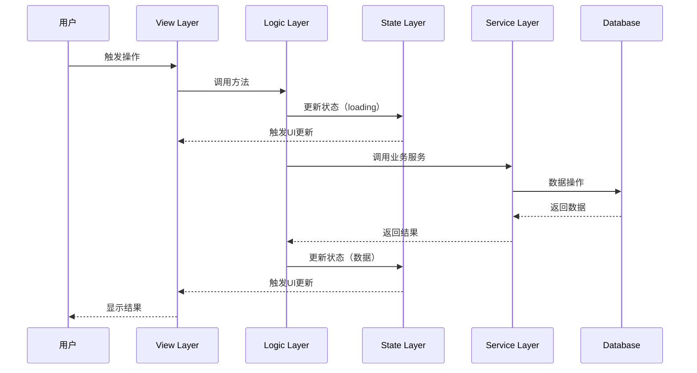
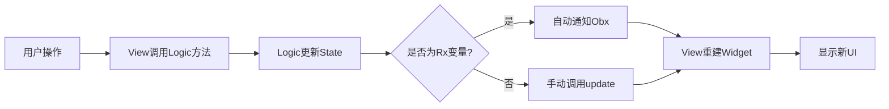
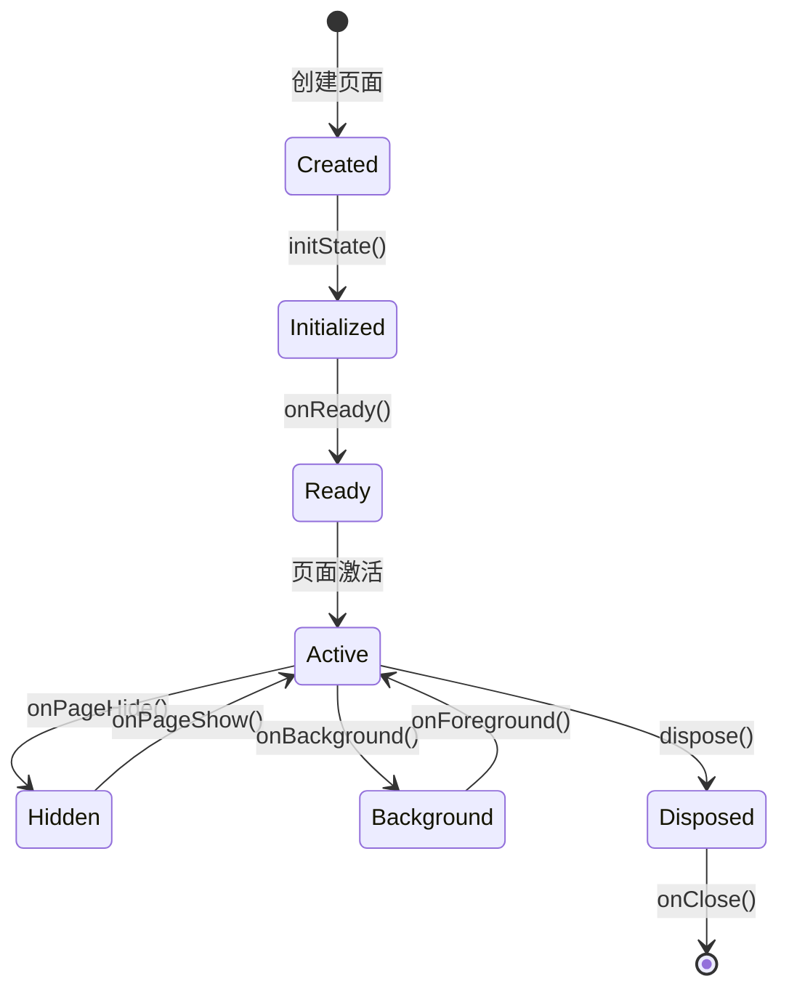
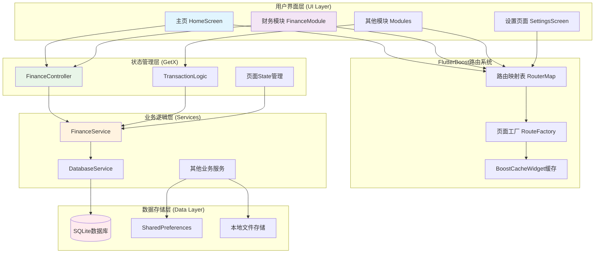
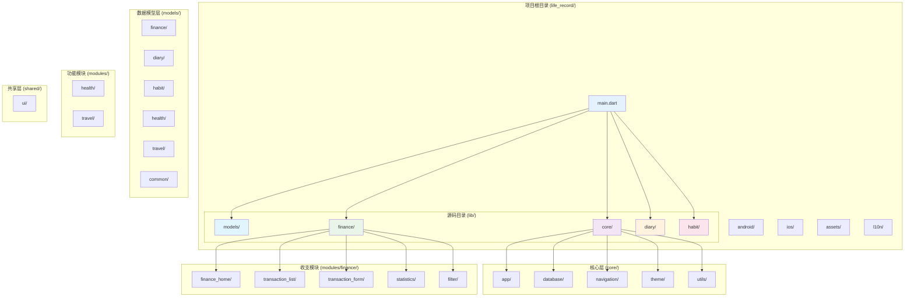
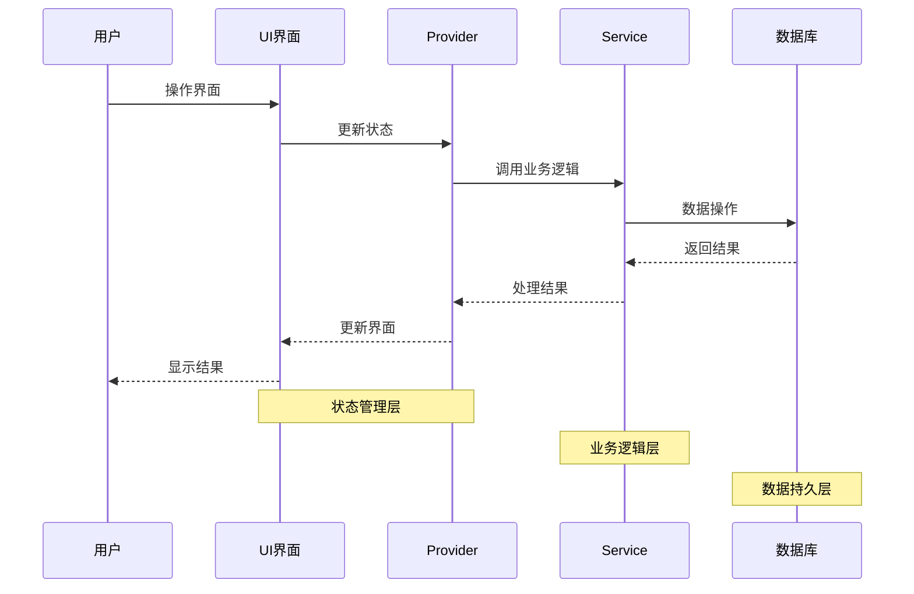
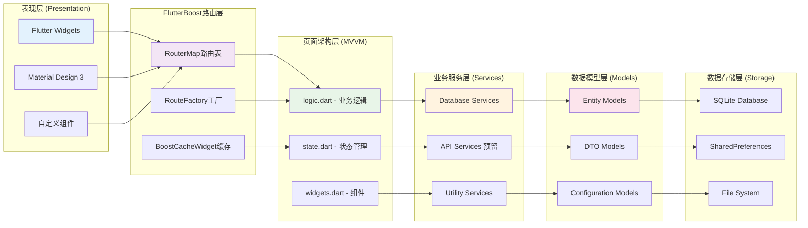
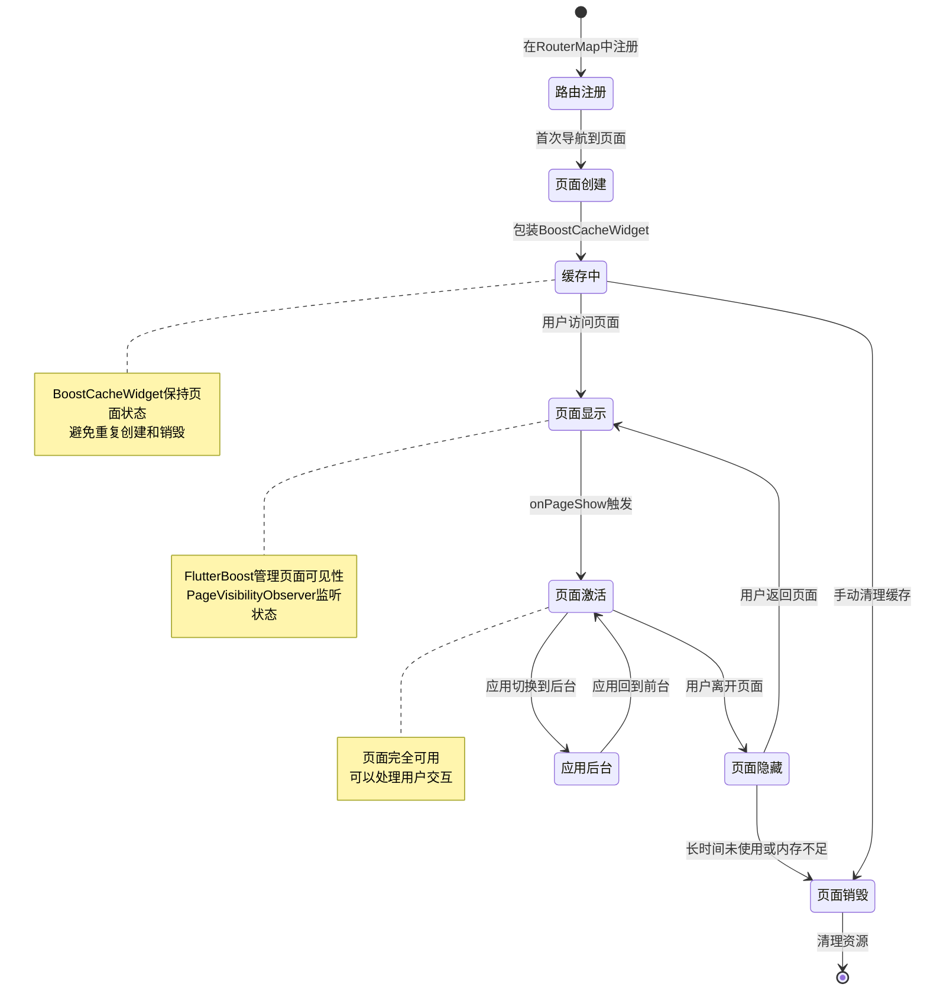
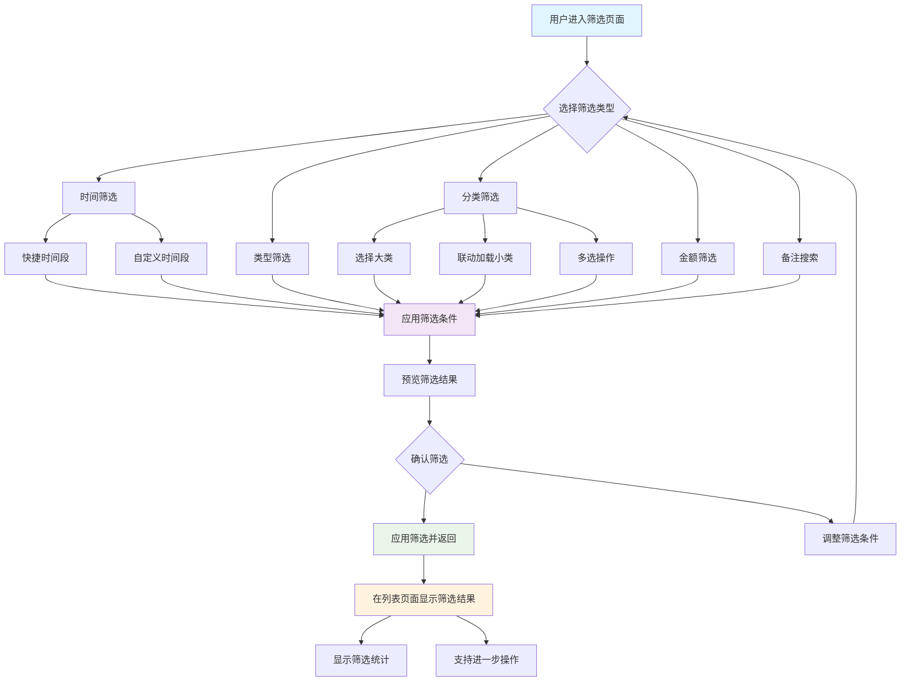

# LifeRecord Flutter应用设计文档

## 1. 应用概述

**应用名称**: LifeRecord  
**平台**: Flutter (iOS/Android)  
**目标**: 提供一个简洁易用的生活记录工具，专注于记录和管理日常生活中的收支情况  
**当前阶段**: 实现基础收支记录功能

## 2. 整体架构设计

### 2.1 技术栈
- **前端框架**: Flutter 3.x
- **路由管理**: FlutterBoost (原生-Flutter混合导航)
- **状态管理**: GetX (MVVM架构，响应式状态管理)
- **本地数据库**: SQLite (通过sqflite包)
- **UI组件**: Material Design 3
- **页面缓存**: BoostCacheWidget (性能优化)
- **屏幕适配**: flutter_screenutil
- **国际化**: flutter_localizations
- **工具库**: flutter_smart_dialog, geocoding, 等

### 2.2 项目结构

LifeRecord 采用模块化架构，遵循清晰的职责分离原则。项目结构分为应用层、核心层、模块层和共享层，确保代码的可维护性和可扩展性。

```
life_record/                     # 项目根目录
├── android/                     # Android平台特定代码
├── ios/                         # iOS平台特定代码
├── lib/                         # Flutter源码目录
│   ├── models/                  # 数据模型层（按模块组织）
│   │   ├── finance/             # 财务模块数据模型
│   │   │   ├── transaction.dart # 交易记录模型
│   │   │   ├── category.dart    # 分类模型
│   │   │   ├── filter_criteria.dart # 筛选条件模型
│   │   │   └── filter_preset.dart   # 筛选模板模型
│   │   ├── diary/               # 日记模块数据模型（预留）
│   │   ├── habit/               # 习惯模块数据模型（预留）
│   │   ├── health/              # 健康模块数据模型（预留）
│   │   ├── travel/              # 旅行模块数据模型（预留）
│   │   └── common/              # 通用数据模型
│   │       ├── base_model.dart  # 基础模型类
│   │       └── api_response.dart # API响应模型
│   ├── core/                    # 核心功能层（应用级）
│   │   ├── app/                 # 应用核心
│   │   │   ├── app.dart         # 应用入口类
│   │   │   ├── routes.dart      # 路由配置
│   │   │   └── lifecycle.dart   # 应用生命周期管理
│   │   ├── database/            # 数据库层
│   │   │   ├── models/          # 数据库模型
│   │   │   ├── services/        # 数据库服务
│   │   │   └── migrations/      # 数据库迁移
│   │   ├── navigation/          # 导航管理
│   │   │   ├── router.dart      # 路由管理器
│   │   │   └── guards/          # 路由守卫
│   │   ├── theme/               # 主题配置
│   │   │   ├── colors.dart      # 颜色定义
│   │   │   ├── themes.dart      # 主题配置
│   │   │   └── typography.dart  # 字体样式
│   │   └── utils/               # 核心工具类
│   │       ├── constants.dart   # 应用常量
│   │       ├── extensions/      # Dart扩展
│   │       ├── formatters/      # 格式化工具
│   │       ├── validators/      # 验证工具
│   │       └── converters/      # 转换工具
│   └── modules/              # 功能模块层
│       ├── finance/             # 财务模块
│       │   ├── finance_home/          # 财务主页
│       │   │   ├── view.dart          # 主页面UI
│       │   │   ├── logic.dart         # 页面逻辑
│       │   │   ├── state.dart         # 页面状态
│       │   │   └── widgets.dart       # 页面组件
│       │   ├── transaction_list/      # 交易记录列表页
│       │   │   ├── view.dart          # 列表页面UI
│       │   │   ├── logic.dart         # 列表页面逻辑
│       │   │   ├── state.dart         # 列表页面状态
│       │   │   └── widgets.dart       # 列表页面组件
│       │   ├── transaction_form/      # 交易记录表单页
│       │   │   ├── view.dart          # 表单页面UI
│       │   │   ├── logic.dart         # 表单页面逻辑
│       │   │   ├── state.dart         # 表单页面状态
│       │   │   └── widgets.dart       # 表单页面组件
│       │   ├── statistics/            # 统计页面
│       │   │   ├── view.dart          # 统计页面UI
│       │   │   ├── logic.dart         # 统计页面逻辑
│       │   │   ├── state.dart         # 统计页面状态
│       │   │   └── widgets.dart       # 统计页面组件
│       │   └── filter/                # 筛选页面
│       │           ├── view.dart          # 筛选页面UI
│       │           ├── logic.dart         # 筛选页面逻辑
│       │           ├── state.dart         # 筛选页面状态
│       │           └── widgets.dart       # 筛选页面组件
│       ├── diary/               # 日记模块（预留）
│       ├── habit/               # 习惯追踪模块（预留）
│       ├── health/              # 健康管理模块（预留）
│       └── travel/              # 旅行记录模块（预留）
│   ├── shared/                  # 共享组件层
│   │   └── ui/                  # 共享UI组件
│   │       ├── components/      # 基础组件
│   │       ├── layouts/         # 布局组件
│   │       └── animations/      # 动画组件
│   ├── config/                  # 应用配置层
│   │   ├── app_config.dart      # 应用配置
│   │   ├── module_config.dart   # 模块配置
│   │   ├── navigation_config.dart # 导航配置
│   │   └── feature_flags.dart   # 功能开关
│   └── main.dart                # 应用入口文件
├── assets/                      # 静态资源
│   ├── images/                  # 图片资源
│   ├── icons/                   # 图标资源
│   ├── fonts/                   # 字体文件
│   └── animations/              # 动画资源
├── l10n/                        # 国际化资源
│   ├── intl_en.arb              # 英文翻译
│   ├── intl_zh.arb              # 中文翻译
│   └── l10n.dart                # 本地化配置
├── analysis_options.yaml        # 代码分析配置
├── pubspec.yaml                 # 项目依赖配置
├── README.md                    # 项目说明文档
└── flutter_launcher_icons.yaml  # 应用图标配置
```

### 2.2.1 目录职责说明

#### **数据模型层 (models/)**
- **职责范围**: 存放各模块的数据结构类和实体模型
- **组织方式**: 按模块划分子目录，每个模块独立管理自己的数据模型
- **使用原则**: 数据模型应只包含数据定义，不包含业务逻辑
- **包含内容**:
  - 各模块的实体类定义
  - 数据传输对象(DTO)
  - 枚举类型和常量
  - 序列化/反序列化方法

#### **核心功能层 (core/)**
- **职责范围**: 提供应用级的基础功能和服务
- **使用原则**: 只包含应用通用的核心功能，不应包含具体业务逻辑
- **包含内容**:
  - 应用生命周期管理
  - 数据库基础服务
  - 路由导航框架
  - 主题和样式配置
  - 核心工具函数（常量、扩展、格式化、验证、转换）

#### **功能模块层 (modules/)**
- **职责范围**: 实现具体的UI界面和页面逻辑，每个模块独立开发和维护
- **使用原则**: 模块间低耦合，通过标准接口进行通信
- **架构模式**: 每个页面采用 View-Logic-State-Widgets 四层架构
- **页面结构**: 每个页面独立目录，包含view.dart、logic.dart、state.dart、widgets.dart
- **包含内容**:
  - [module_name]/: 模块目录，每个模块包含其所有页面目录

#### **共享组件层 (shared/)**
- **职责范围**: 提供跨模块共享的UI组件
- **使用原则**: 只包含真正跨模块共享的内容，不包含业务逻辑或数据访问
- **包含内容**:
  - ui/: 通用UI组件库（按钮、表单、卡片等基础组件）

#### **应用配置层 (config/)**
- **职责范围**: 管理应用的配置信息和模块注册
- **使用原则**: 配置与代码分离，支持运行时动态调整
- **包含内容**:
  - 应用基础配置
  - 模块注册配置
  - 导航路由配置
  - 功能开关控制

#### **国际化目录 (l10n/)**
- **职责范围**: 支持多语言界面和本地化内容
- **实现方式**: 使用Flutter Intl插件管理翻译资源
- **支持语言**: 中文、英文，可扩展其他语言

#### **静态资源 (assets/)**
- **职责范围**: 管理应用的图片、图标、字体等静态资源
- **组织方式**: 按类型分类存放，便于管理和维护
- **优化策略**: 合理压缩和缓存，提升应用性能

### 2.3 设计原则
- **简洁性**: 界面简洁，操作直观
- **本地优先**: 所有数据存储在本地设备
- **模块化**: 功能模块独立，便于扩展，支持动态加载
- **配置化**: 通过配置文件动态管理功能模块
- **响应式**: 支持不同屏幕尺寸
- **可扩展性**: 架构设计预留扩展空间，便于后续功能模块添加

### 2.4 模块配置系统
```dart
// 模块配置模型
class ModuleConfig {
  final String id;              // 模块唯一标识
  final String name;            // 模块名称
  final String icon;            // 模块图标
  final String route;           // 模块路由
  final bool enabled;           // 是否启用
  final int order;              // 显示顺序
  final ModuleType type;        // 模块类型
  final Map<String, dynamic> settings; // 模块设置
}

// 导航配置
class NavigationConfig {
  final List<BottomNavItem> bottomNavItems;  // 底部导航项
  final List<DrawerMenuItem> drawerItems;    // 抽屉菜单项
  final List<ModuleCard> moduleCards;        // 主页模块卡片
}

// 模块类型枚举
enum ModuleType {
  finance,      // 财务管理
  diary,        // 日记
  habit,        // 习惯追踪
  health,       // 健康管理
  travel,       // 旅行记录
  custom        // 自定义模块
}
```

## 3. 页面架构设计规范（基于 GetX + MVVM 模式）

### 3.1 整体架构模式

LifeRecord 应用采用 **View-Logic-State-Widgets** 四层分离架构，结合 GetX 状态管理框架，实现清晰的职责分离和高效的状态管理。

#### 3.1.1 架构层次说明

```
┌─────────────────────────────────────────────────────┐
│                    View Layer                        │
│  (view.dart - UI展示层，负责页面布局和用户交互)      │
└──────────────────┬──────────────────────────────────┘
                   │ 调用
┌──────────────────▼──────────────────────────────────┐
│                   Logic Layer                        │
│  (logic.dart - 业务逻辑层，处理业务逻辑和状态更新)   │
└──────────────────┬──────────────────────────────────┘
                   │ 管理
┌──────────────────▼──────────────────────────────────┐
│                   State Layer                        │
│  (state.dart - 状态数据层，存储页面状态和配置)      │
└─────────────────────────────────────────────────────┘
                   │ 使用
┌──────────────────▼──────────────────────────────────┐
│                  Widgets Layer                       │
│  (widgets.dart - 组件层，可复用的UI组件)            │
└─────────────────────────────────────────────────────┘
```

### 3.2 页面结构标准

每个功能页面独立组织在单独的目录中，采用四层架构模式：

```
lib/modules/finance/transaction_list/
├── view.dart           # UI视图层（页面主界面）
├── logic.dart          # 业务逻辑层（控制器）
├── state.dart          # 状态数据层（响应式状态）
└── widgets.dart        # 页面专用组件（可选）
```

**目录组织原则**：
- 每个页面对应一个独立的目录
- 目录名使用小写字母和下划线组合
- 页面目录位于对应模块的 `ui/views/` 下

**文件职责分工**：
- `view.dart`: 主页面UI文件，包含完整的页面布局和用户交互绑定
- `logic.dart`: 业务逻辑控制器，处理用户交互事件和数据操作
- `state.dart`: 状态管理文件，定义响应式变量和页面状态数据
- `widgets.dart`: 页面专用组件，页面内复用的UI组件（可选）

### 3.3 各层职责详解

#### 3.3.1 View Layer（view.dart）

**职责**：
- 页面UI布局和渲染
- 用户交互事件绑定
- 调用 Logic 层方法
- 监听 State 变化并更新UI

**设计规范**：
- 页面构造函数接收 `params` 参数用于接收路由参数
- State 继承统一的页面基类（`CommonPageState`）
- 使用 GetX 依赖注入（`Get.put`、`Get.find`）
- 使用 `Obx` 响应式更新UI
- 将UI拆分为独立的Widget方法
- 在 dispose 中清理资源
- 页面通过 `BoostCacheWidget` 包装以优化性能

**关键要点**：
- 继承 `CommonPageState` 统一页面生命周期管理
- 使用 `Obx` 或 `GetBuilder` 实现响应式UI更新
- UI代码应简洁，复杂逻辑委托给 Logic 层
- 将大型Widget拆分为独立的私有方法或独立组件
- 通过构造函数的 `params` 参数接收路由传递的数据

#### 3.3.2 Logic Layer（logic.dart）

**职责**：
- 处理业务逻辑
- 调用 Service 层进行数据操作
- 管理页面状态（通过 State）
- 处理用户交互事件
- 页面生命周期管理

**设计规范**：
- 继承 `GetxController` 获得生命周期管理能力
- 所有业务逻辑集中在 Logic 层
- 通过 State 对象管理页面状态
- 异步操作使用 async/await 模式
- 统一的错误处理机制
- 清晰的方法命名（on前缀表示事件处理）

**关键要点**：
- 在 `onReady` 中处理初始化逻辑
- 使用依赖注入获取服务层实例
- 提供清晰的公共方法供 View 调用
- 实现导航控制方法
- 在 `onClose` 中清理资源

#### 3.3.3 State Layer（state.dart）

**职责**：
- 存储页面状态数据
- 定义响应式变量
- 存储页面配置信息
- 管理临时数据

**设计规范**：
- 使用 `Rx` 类型（RxBool、RxInt、RxList等）创建响应式变量
- 使用 `.obs` 将普通变量转为响应式
- 区分响应式数据和普通数据
- 提供计算属性简化逻辑
- 支持多步骤流程的配置化管理

**关键要点**：
- 响应式数据用于需要自动更新UI的场景
- 普通数据用于不需要触发UI更新的场景
- 使用 Map 配置多步骤流程的状态
- 提供 dispose 方法清理资源

#### 3.3.4 Widgets Layer（widgets.dart）

**职责**：
- 封装页面专用的可复用组件
- 减少 View 层代码复杂度
- 提高组件复用性

**设计规范**：
- 创建独立的 StatelessWidget 或 StatefulWidget
- 通过构造函数传递必要的数据和回调
- 组件应该是纯UI组件，不包含业务逻辑
- 提供清晰的参数命名和类型

### 3.4 页面基类设计

#### 3.4.1 CommonPageState 基类

所有页面的 State 类应继承统一的基类，提供通用功能：

**基类提供的能力**：
- 统一的返回按钮处理
- 页面可见性监听
- 应用前后台切换监听
- 埋点上报支持
- 生命周期管理

**子类需要实现**：
- `pageName`：页面标识（必须）
- `onBackPressed()`：自定义返回逻辑（可选）
- `onPageShow()`：页面显示回调（可选）
- `onPageHide()`：页面隐藏回调（可选）

### 3.5 全局控制器设计

#### 3.5.1 模块控制器设计

每个模块可以设计专用的全局控制器，采用 GetX Controller 模式：

**FinanceController（财务模块控制器）**：
```dart
class FinanceController extends GetxController {
  // 全局状态管理
  final currentTransaction = Rx<Transaction?>(null);
  final currentFilter = Rx<FilterCriteria?>(null);

  // 业务方法
  void setCurrentTransaction(Transaction? transaction) {
    currentTransaction.value = transaction;
  }

  void setCurrentFilter(FilterCriteria? filter) {
    currentFilter.value = filter;
  }

  // 导航方法
  void navigateToTransactionList() {
    BoostNavigator.instance.push('flutter_finance_transaction_list_page');
  }

  void navigateToAddTransaction({String? type}) {
    BoostNavigator.instance.push('flutter_finance_add_transaction_page',
      arguments: {'type': type});
  }

  // 业务流程回调
  void onTransactionSaved(Transaction transaction) {
    // 处理交易保存后的逻辑
    setCurrentTransaction(null);
    navigateToTransactionList();
  }
}
```

**控制器职责**：
- 管理模块内的全局状态
- 提供统一的导航入口
- 协调模块内的业务流程
- 处理跨页面的数据传递

### 3.6 路由导航设计

LifeRecord 应用采用 FlutterBoost 框架进行路由管理，通过集中式的路由映射表实现页面导航，支持参数传递和页面缓存优化。

#### 3.6.1 路由映射表设计

使用 `Map<String, FlutterBoostRouteFactory>` 创建路由映射表：
```dart
Map<String, FlutterBoostRouteFactory> routerMap = {
  'flutter_transaction_list_page': (settings, uniqueId) {
    return MaterialPageRoute(
      settings: settings,
      builder: (ctx) => BoostCacheWidget(
        uniqueId: uniqueId!,
        builder: (_) => TransactionListPage(
          params: settings.arguments as Map<dynamic, dynamic>?,
        ),
      ),
    );
  },
  // ... 其他路由
};
```

**路由命名规范**：
- 前缀：`flutter_`（标识Flutter模块路由）
- 页面标识：`模块名_页面功能_page`
- 示例：`flutter_finance_transaction_list_page`、`flutter_finance_add_transaction_page`

#### 3.6.2 页面路由工厂

每个路由对应一个工厂函数，返回具体的路由对象：

**标准路由工厂**：
```dart
'flutter_page_name': (settings, uniqueId) {
  return MaterialPageRoute(
    settings: settings,
    builder: (ctx) => BoostCacheWidget(
      uniqueId: uniqueId!,
      builder: (_) => TargetPage(
        params: settings.arguments as Map<dynamic, dynamic>?,
      ),
    ),
  );
}
```

**透明背景路由工厂**（用于相机等特殊页面）：
```dart
'flutter_camera_page': (settings, uniqueId) {
  return PageRouteBuilder(
    settings: settings,
    opaque: false,
    barrierColor: Colors.transparent,
    transitionDuration: const Duration(milliseconds: 0),
    pageBuilder: (ctx, animation, secondaryAnimation) => CameraPage(
      params: settings.arguments as Map<dynamic, dynamic>?,
    ),
  );
}
```

#### 3.6.3 页面缓存优化

使用 `BoostCacheWidget` 包装页面以优化性能：
- 避免页面多次重建
- 提升页面切换流畅度
- 减少不必要的资源消耗

#### 3.6.4 导航参数传递

**参数传递方式**：
1. 通过 `settings.arguments` 传递 Map 类型参数
2. 支持基础数据类型和复杂对象序列化

**参数接收方式**：
1. 在页面构造函数中接收 `params` 参数
2. 在 Logic 层的 `onReady` 中处理初始化参数

**参数类型转换**：
```dart
// 接收参数示例
class TransactionListPage extends StatelessWidget {
  final Map<dynamic, dynamic>? params;

  const TransactionListPage({this.params, Key? key}) : super(key: key);

  @override
  Widget build(BuildContext context) {
    // 参数处理逻辑
    return Container();
  }
}
```

#### 3.6.5 导航触发方式

**原生到Flutter页面导航**：
```dart
BoostNavigator.instance.push('flutter_transaction_list_page', arguments: {
  'filterType': 'income',
  'startDate': '2024-01-01',
});
```

**Flutter页面间导航**：
```dart
// 使用 BoostNavigator 进行页面跳转
BoostNavigator.instance.push('flutter_add_transaction_page', arguments: {
  'transactionType': 'expense',
  'categoryId': 1,
});
```

**带返回值的导航**：
```dart
// 异步等待页面返回结果
final result = await BoostNavigator.instance.push('flutter_select_category_page');
if (result != null) {
  // 处理返回的数据
  handleCategorySelected(result);
}
```

#### 3.6.6 路由生命周期管理

**页面创建和销毁**：
- 路由工厂函数在页面首次创建时调用
- `BoostCacheWidget` 在页面不可见时保持状态
- `uniqueId` 用于标识页面实例

**页面可见性监听**：
- 通过 `PageVisibilityBinding` 监听页面显示/隐藏
- 支持页面前后台切换监听
- 便于实现埋点和资源管理

### 3.7 状态管理模式

#### 3.7.1 响应式更新

使用 `Obx` 实现局部响应式更新：
- 只在需要更新的Widget外包裹 `Obx`
- 避免在大范围Widget上使用 `Obx`
- 多个独立的响应式区域使用多个 `Obx`

#### 3.7.2 状态更新

在 Logic 层更新状态：
- 直接修改 `.value` 属性
- 使用 `assignAll` 批量更新列表
- 使用 `add`、`remove` 等方法操作集合

### 3.8 页面间通信

#### 3.8.1 通过路由参数传递

**适用场景**：
- 页面间传递初始化数据
- 传递简单配置参数
- 页面创建时的参数传递

**实现方式**：
```dart
// 发送参数
BoostNavigator.instance.push('flutter_transaction_detail_page', arguments: {
  'transactionId': 123,
  'editMode': true,
});

// 接收参数
class TransactionDetailPage extends StatelessWidget {
  final Map<dynamic, dynamic>? params;

  const TransactionDetailPage({this.params, Key? key}) : super(key: key);

  @override
  Widget build(BuildContext context) {
    final transactionId = params?['transactionId'] as int?;
    final editMode = params?['editMode'] as bool? ?? false;
    // 使用参数进行页面初始化
    return Container();
  }
}
```

#### 3.8.2 通过全局控制器

**适用场景**：
- 跨页面共享复杂状态
- 业务流程中的数据传递
- 模块内的状态同步

**实现方式**：
```dart
// 在控制器中存储状态
class FinanceController extends GetxController {
  final selectedTransaction = Rx<Transaction?>(null);

  void selectTransaction(Transaction transaction) {
    selectedTransaction.value = transaction;
  }
}

// 页面A设置数据
final controller = Get.find<FinanceController>();
controller.selectTransaction(transaction);

// 页面B获取数据
class TransactionDetailLogic extends GetxController {
  final controller = Get.find<FinanceController>();

  @override
  void onReady() {
    super.onReady();
    final transaction = controller.selectedTransaction.value;
    if (transaction != null) {
      // 使用交易数据初始化页面
      loadTransactionDetail(transaction.id);
    }
  }
}
```

#### 3.8.3 通过页面返回值

**适用场景**：
- 选择器页面返回选择结果
- 表单页面返回保存的数据
- 确认对话框返回用户选择

**实现方式**：
```dart
// 页面A发起导航并等待结果
Future<void> selectCategory() async {
  final result = await BoostNavigator.instance.push('flutter_category_selector_page');
  if (result != null && result is Map) {
    final selectedCategory = Category.fromJson(result);
    // 处理选择的分类
    updateSelectedCategory(selectedCategory);
  }
}

// 页面B返回结果
void onCategorySelected(Category category) {
  BoostNavigator.instance.pop(result: category.toJson());
}
```

#### 3.8.4 通过 Boost 事件通道

**适用场景**：
- 原生与Flutter间的通信
- 跨模块的事件通知
- 系统级事件监听（如语言切换）

**实现方式**：
```dart
// 监听语言切换事件
BoostChannel.instance.addEventListener("changeLanguage", (key, arguments) {
  if (arguments != null && arguments.containsKey('languageCode')) {
    final code = arguments['languageCode'];
    // 处理语言切换逻辑
    updateAppLanguage(code);
  }
  return Future.value(null);
});
```

### 3.9 FlutterBoost 集成设计

#### 3.9.1 框架初始化

**CustomFlutterBinding**：
```dart
class CustomFlutterBinding extends WidgetsFlutterBinding
    with BoostFlutterBinding {}
```

**应用入口配置**：
```dart
void main() async {
  // 创建自定义Binding
  CustomFlutterBinding();

  // 初始化FlutterBoost
  PageVisibilityBinding.instance.addGlobalObserver(AppGlobalPageVisibilityObserver());

  runApp(MyApp());
}
```

#### 3.9.2 路由系统架构

**FlutterBoostApp配置**：
```dart
class MyApp extends StatefulWidget {
  @override
  Widget build(BuildContext context) {
    return FlutterBoostApp(
      routeFactory,  // 路由工厂函数
      appBuilder: appBuilder,  // 应用构建器
    );
  }
}
```

**路由工厂实现**：
```dart
Route<dynamic>? routeFactory(RouteSettings settings, String? uniqueId) {
  FlutterBoostRouteFactory? func = routerMap[settings.name!];
  if (func == null) {
    return null;
  }
  return func(settings, uniqueId);
}
```

#### 3.9.3 页面可见性管理

**全局页面观察者**：
```dart
class AppGlobalPageVisibilityObserver extends GlobalPageVisibilityObserver {
  @override
  void onPageShow(Route<dynamic> route) {
    // 页面显示时的处理逻辑
    Log.i('Page Show: ${route.settings.name}');
  }

  @override
  void onPageHide(Route<dynamic> route) {
    // 页面隐藏时的处理逻辑
    Log.i('Page Hide: ${route.settings.name}');
  }
}
```

#### 3.9.4 页面生命周期集成

**与GetX生命周期结合**：
```dart
class TransactionListLogic extends GetxController {
  @override
  void onReady() {
    super.onReady();
    // 页面初始化逻辑
    // FlutterBoost的onPageShow时会触发
  }

  @override
  void onClose() {
    // 页面销毁逻辑
    // FlutterBoost的onPageHide时会触发
    super.onClose();
  }
}
```

#### 3.9.5 性能优化策略

**BoostCacheWidget使用**：
- 避免页面重建，提升切换流畅度
- 保持页面状态，减少数据重新加载
- 内存管理优化，自动清理不活跃页面

**路由懒加载**：
- 页面路由工厂延迟创建页面实例
- 根据需要动态加载页面组件
- 减少应用启动时的初始化开销

### 3.9 错误处理和加载状态

#### 3.9.1 统一的加载状态管理

在 State 中定义：
- `isLoading`：初始加载状态
- `isRefreshing`：刷新状态
- `errorMessage`：错误信息

在 Logic 中处理：
- try-catch 捕获异常
- finally 块中重置加载状态
- 使用 SmartDialog 显示错误提示

在 View 中展示：
- 根据 `isLoading` 显示加载动画
- 根据 `errorMessage` 显示错误状态
- 提供重试按钮

### 3.10 最佳实践总结

#### 3.10.1 命名规范

- **文件命名**：小写下划线（transaction_list_page.dart）
- **类命名**：大驼峰（TransactionListPage）
- **方法命名**：小驼峰（loadTransactions）
- **事件处理方法**：on前缀（onDeleteTransaction）
- **私有方法**：下划线前缀（_handleError）
- **导航方法**：to前缀（toTransactionListPage）

#### 3.10.2 代码组织

**View 层顺序**：
1. 类定义和构造函数
2. 静态导航方法
3. State 类定义
4. Logic 和 State 实例
5. 生命周期方法（initState、dispose等）
6. build 方法
7. Widget 构建方法（按UI层次组织）
8. 事件处理方法

**Logic 层顺序**：
1. State 实例
2. 依赖注入
3. 生命周期方法（onReady、onClose）
4. 公共业务方法
5. 事件处理方法
6. 导航方法
7. 私有辅助方法

**State 层顺序**：
1. 响应式变量
2. 普通状态变量
3. 配置数据
4. 计算属性
5. 方法

#### 3.10.3 性能优化

1. **精确的响应式范围**：
   - 只在需要更新的Widget外包裹 `Obx`
   - 避免在大范围Widget上使用 `Obx`

2. **列表优化**：
   - 使用 `ListView.builder` 而非 `ListView`
   - 为列表项提供唯一的 `key`

3. **资源清理**：
   - 在 `dispose` 中清理定时器、监听器
   - 在 `onClose` 中取消异步操作

4. **懒加载**：
   - 使用 `Get.lazyPut` 延迟初始化 Controller
   - 分页加载大数据列表

#### 3.10.4 测试友好

1. **依赖注入**：
   - 通过 `Get.find` 获取依赖
   - 便于单元测试时 mock

2. **逻辑分离**：
   - View 层只负责UI
   - Logic 层可独立测试

3. **状态可测试**：
   - State 是纯数据类
   - 易于验证状态变化

### 3.11 页面架构图示

#### 3.11.1 页面架构流程图



#### 3.11.2 GetX 状态管理流程



#### 3.11.3 页面生命周期



## 4. 收支记录模块设计

### 4.1 功能需求
- 添加收支记录（收入/支出）
- 查看收支历史记录
- 按日期筛选记录
- 统计收支概况
- 编辑/删除记录
- 分类管理（预支出、餐饮、交通等）

### 4.2 数据模型设计

#### 4.2.1 收支记录模型 (Transaction)
```dart
class Transaction {
  final int? id;
  final double amount;           // 金额
  final String type;             // 'income' 或 'expense'
  final int categoryId;          // 小类ID (外键关联categories表)
  final int parentCategoryId;    // 大类ID (外键关联categories表)
  final String? description;     // 备注说明 (可选)
  final DateTime date;           // 日期时间
  final DateTime createdAt;      // 创建时间
  final DateTime? updatedAt;     // 更新时间

  Transaction({
    this.id,
    required this.amount,
    required this.type,
    required this.categoryId,
    required this.parentCategoryId,
    this.description,
    required this.date,
    required this.createdAt,
    this.updatedAt,
  });

  // 获取完整分类名称 (大类→小类)，通过关联查询获取
  Future<String> getFullCategoryName(DatabaseService db) async {
    final category = await db.getCategoryById(categoryId);
    final parentCategory = await db.getCategoryById(parentCategoryId);
    return '${parentCategory?.name ?? ''}→${category?.name ?? ''}';
  }

  // 获取小类名称，通过关联查询获取
  Future<String?> getCategoryName(DatabaseService db) async {
    final category = await db.getCategoryById(categoryId);
    return category?.name;
  }

  // 获取大类名称，通过关联查询获取
  Future<String?> getParentCategoryName(DatabaseService db) async {
    final category = await db.getCategoryById(parentCategoryId);
    return category?.name;
  }
}
```

#### 4.2.1.1 筛选条件模型 (FilterCriteria)
```dart
class FilterCriteria {
  final DateTime? startDate;           // 开始日期
  final DateTime? endDate;             // 结束日期
  final String? type;                  // 收支类型: 'income', 'expense', null(全部)
  final List<int>? categoryIds;        // 小类ID列表 (支持多选)
  final List<int>? parentCategoryIds;  // 大类ID列表 (支持多选)
  final double? minAmount;             // 最小金额
  final double? maxAmount;             // 最大金额
  final String? searchKeyword;         // 备注搜索关键词
  final bool? hasDescription;          // 是否有备注筛选

  FilterCriteria({
    this.startDate,
    this.endDate,
    this.type,
    this.categoryIds,
    this.parentCategoryIds,
    this.minAmount,
    this.maxAmount,
    this.searchKeyword,
    this.hasDescription,
  });

  // 创建副本用于修改
  FilterCriteria copyWith({
    DateTime? startDate,
    DateTime? endDate,
    String? type,
    List<int>? categoryIds,
    List<int>? parentCategoryIds,
    double? minAmount,
    double? maxAmount,
    String? searchKeyword,
    bool? hasDescription,
  }) {
    return FilterCriteria(
      startDate: startDate ?? this.startDate,
      endDate: endDate ?? this.endDate,
      type: type ?? this.type,
      categoryIds: categoryIds ?? this.categoryIds,
      parentCategoryIds: parentCategoryIds ?? this.parentCategoryIds,
      minAmount: minAmount ?? this.minAmount,
      maxAmount: maxAmount ?? this.maxAmount,
      searchKeyword: searchKeyword ?? this.searchKeyword,
      hasDescription: hasDescription ?? this.hasDescription,
    );
  }

  // 检查是否有活跃的筛选条件
  bool get hasActiveFilters =>
    startDate != null ||
    endDate != null ||
    type != null ||
    (categoryIds?.isNotEmpty ?? false) ||
    (parentCategoryIds?.isNotEmpty ?? false) ||
    minAmount != null ||
    maxAmount != null ||
    (searchKeyword?.isNotEmpty ?? false) ||
    hasDescription != null;

  // 清空所有筛选条件
  FilterCriteria clear() {
    return FilterCriteria();
  }

  // 获取筛选条件的文字描述
  String getFilterDescription() {
    List<String> parts = [];

    if (startDate != null && endDate != null) {
      parts.add('时间: ${startDate!.year}-${startDate!.month}-${startDate!.day} 至 ${endDate!.year}-${endDate!.month}-${endDate!.day}');
    } else if (startDate != null) {
      parts.add('从 ${startDate!.year}-${startDate!.month}-${startDate!.day} 开始');
    } else if (endDate != null) {
      parts.add('至 ${endDate!.year}-${endDate!.month}-${endDate!.day}');
    }

    if (type != null) {
      parts.add('类型: ${type == 'income' ? '收入' : '支出'}');
    }

    if (categoryIds?.isNotEmpty ?? false) {
      parts.add('分类: ${categoryIds!.length} 个小类');
    }

    if (parentCategoryIds?.isNotEmpty ?? false) {
      parts.add('大类: ${parentCategoryIds!.length} 个大类');
    }

    if (minAmount != null || maxAmount != null) {
      String amountStr = '';
      if (minAmount != null && maxAmount != null) {
        amountStr = '${minAmount} - ${maxAmount}';
      } else if (minAmount != null) {
        amountStr = '>= ${minAmount}';
      } else if (maxAmount != null) {
        amountStr = '<= ${maxAmount}';
      }
      parts.add('金额: ${amountStr}');
    }

    if (searchKeyword?.isNotEmpty ?? false) {
      parts.add('备注: "${searchKeyword}"');
    }

    return parts.isEmpty ? '无筛选条件' : parts.join(', ');
  }
}
```

#### 4.2.1.2 筛选模板模型 (FilterPreset)
```dart
class FilterPreset {
  final String id;                    // 模板唯一标识
  final String name;                  // 模板名称
  final FilterCriteria criteria;      // 筛选条件
  final DateTime createdAt;           // 创建时间
  final DateTime? updatedAt;          // 更新时间
  final int? useCount;               // 使用次数 (统计用户偏好)

  FilterPreset({
    required this.id,
    required this.name,
    required this.criteria,
    DateTime? createdAt,
    this.updatedAt,
    this.useCount = 0,
  }) : createdAt = createdAt ?? DateTime.now();

  // 使用模板时增加使用次数
  FilterPreset incrementUseCount() {
    return FilterPreset(
      id: id,
      name: name,
      criteria: criteria,
      createdAt: createdAt,
      updatedAt: DateTime.now(),
      useCount: (useCount ?? 0) + 1,
    );
  }

  // 更新模板条件
  FilterPreset updateCriteria(FilterCriteria newCriteria) {
    return FilterPreset(
      id: id,
      name: name,
      criteria: newCriteria,
      createdAt: createdAt,
      updatedAt: DateTime.now(),
      useCount: useCount,
    );
  }
}
```

#### 4.2.2 收支分类模型 (Category)
```dart
class Category {
  final int? id;
  final String name;             // 分类名称
  final String type;             // 'income' 或 'expense'
  final String icon;             // 图标名称
  final String color;            // 颜色代码
  final int sortOrder;           // 排序顺序
  final int? parentId;           // 父分类ID，为null表示大类
  final bool isDefault;          // 是否为系统预设分类
  final DateTime? createdAt;     // 创建时间
  final DateTime? updatedAt;     // 更新时间

  Category({
    this.id,
    required this.name,
    required this.type,
    required this.icon,
    required this.color,
    required this.sortOrder,
    this.parentId,
    this.isDefault = false,
    this.createdAt,
    this.updatedAt,
  });

  // 是否为大类（父分类）
  bool get isParent => parentId == null;

  // 是否为小类（子分类）
  bool get isChild => parentId != null;

  // 获取完整分类路径（用于显示）
  Future<String> getFullPath(DatabaseService db) async {
    if (isParent) {
      return name;
    } else {
      final parent = await db.getCategoryById(parentId!);
      return '${parent?.name ?? '未知大类'} → $name';
    }
  }

  // 获取子分类数量（仅对大类有效）
  Future<int> getChildCount(DatabaseService db) async {
    if (isParent && id != null) {
      return await db.getChildCategoryCount(id!);
    }
    return 0;
  }

  // 验证分类数据的完整性
  bool get isValid {
    return name.isNotEmpty &&
           (type == 'income' || type == 'expense') &&
           icon.isNotEmpty &&
           color.isNotEmpty &&
           sortOrder >= 0;
  }

  // 创建副本用于修改
  Category copyWith({
    int? id,
    String? name,
    String? type,
    String? icon,
    String? color,
    int? sortOrder,
    int? parentId,
    bool? isDefault,
    DateTime? createdAt,
    DateTime? updatedAt,
  }) {
    return Category(
      id: id ?? this.id,
      name: name ?? this.name,
      type: type ?? this.type,
      icon: icon ?? this.icon,
      color: color ?? this.color,
      sortOrder: sortOrder ?? this.sortOrder,
      parentId: parentId ?? this.parentId,
      isDefault: isDefault ?? this.isDefault,
      createdAt: createdAt ?? this.createdAt,
      updatedAt: updatedAt ?? this.updatedAt,
    );
  }

  // 用于排序的比较方法
  int compareTo(Category other) {
    final typeCompare = type.compareTo(other.type);
    if (typeCompare != 0) return typeCompare;

    final parentCompare = (parentId ?? 0).compareTo(other.parentId ?? 0);
    if (parentCompare != 0) return parentCompare;

    return sortOrder.compareTo(other.sortOrder);
  }
}
```

### 4.3 数据库设计

#### 4.3.1 数据库表结构

**transactions 表**:
- id (INTEGER PRIMARY KEY)
- amount (REAL NOT NULL)
- type (TEXT NOT NULL) -- 'income'/'expense'
- category_id (INTEGER NOT NULL) -- 小类ID，外键关联categories表
- parent_category_id (INTEGER NOT NULL) -- 大类ID，外键关联categories表
- description (TEXT) -- 备注说明 (可选)
- date (TEXT NOT NULL) -- ISO 8601格式
- created_at (TEXT NOT NULL)
- updated_at (TEXT)

**filter_presets 表** (新增 - 筛选模板存储):
- id (TEXT PRIMARY KEY)
- name (TEXT NOT NULL)
- criteria_json (TEXT NOT NULL) -- 序列化的FilterCriteria JSON
- created_at (TEXT NOT NULL)
- updated_at (TEXT)
- use_count (INTEGER DEFAULT 0)

**categories 表**:
- id (INTEGER PRIMARY KEY)
- name (TEXT NOT NULL)
- type (TEXT NOT NULL)
- icon (TEXT NOT NULL)
- color (TEXT NOT NULL)
- sort_order (INTEGER NOT NULL)
- parent_id (INTEGER) -- 父分类ID，为NULL表示大类
- is_default (INTEGER NOT NULL DEFAULT 0) -- 是否为系统预设分类
- created_at (TEXT)
- updated_at (TEXT)

#### 4.3.2 数据库服务类
```dart
class DatabaseService {
  // 初始化数据库
  Future<Database> initDatabase();

  // 收支记录 CRUD 操作
  Future<int> insertTransaction(Transaction transaction);
  Future<List<Transaction>> getTransactions({
    DateTime? startDate,
    DateTime? endDate,
    String? type,  // 'income', 'expense', or null for all
    List<int>? categoryIds,  // 小类ID列表
    List<int>? parentCategoryIds,  // 大类ID列表
    double? minAmount,
    double? maxAmount,
    String? searchKeyword,  // 备注搜索关键词
  });
  Future<List<Transaction>> getTransactionsByCategory({
    required String categoryName,
    DateTime? startDate,
    DateTime? endDate,
  });
  Future<int> updateTransaction(Transaction transaction);
  Future<int> deleteTransaction(int id);

  // 分类 CRUD 操作
  Future<int> insertCategory(Category category);
  Future<List<Category>> getCategories(String type);  // 获取所有分类（树形结构）
  Future<List<Category>> getParentCategories(String type);  // 获取大类
  Future<List<Category>> getChildCategories(int parentId);  // 获取指定大类下的小类
  Future<int> updateCategory(Category category);
  Future<int> deleteCategory(int id);

  // 统计查询
  Future<double> getTotalIncome(DateTime startDate, DateTime endDate, {List<String>? categories});
  Future<double> getTotalExpense(DateTime startDate, DateTime endDate, {List<String>? categories});
  Future<Map<String, double>> getCategorySummary(String type, DateTime startDate, DateTime endDate);
  Future<Map<String, double>> getParentCategorySummary(String type, DateTime startDate, DateTime endDate);  // 大类汇总
  Future<Map<String, double>> getChildCategorySummary(int parentId, DateTime startDate, DateTime endDate);  // 小类汇总
  Future<List<Map<String, dynamic>>> getDetailedCategoryStats({
    required String type,
    DateTime? startDate,
    DateTime? endDate,
    bool includeChildren = true,  // 是否包含子分类统计
  });  // 详细分类统计（支持层级）

  // 新增方法：支持FilterCriteria的查询
  Future<List<Transaction>> getTransactionsByFilter(FilterCriteria filter) async {
    return getTransactions(
      startDate: filter.startDate,
      endDate: filter.endDate,
      type: filter.type,
      categoryIds: filter.categoryIds,
      parentCategoryIds: filter.parentCategoryIds,
      minAmount: filter.minAmount,
      maxAmount: filter.maxAmount,
      searchKeyword: filter.searchKeyword,
    );
  }

  // 新增方法：根据ID获取单个分类
  Future<Category?> getCategoryById(int id);

  // 新增方法：获取大类下的小类数量
  Future<int> getChildCategoryCount(int parentId);

  // 新增方法：筛选预设的持久化存储
  Future<void> saveFilterPresets(List<FilterPreset> presets);
  Future<List<FilterPreset>> loadFilterPresets();
}
```

### 4.4 UI界面设计

#### 4.4.1 主页面 (HomeScreen) - 模块化设计
- **顶部应用栏**:
  - 应用标题
  - 通知中心入口
  - 设置入口
- **模块卡片区域**:
  - 网格布局展示已启用的功能模块
  - 每个模块显示图标、名称、快捷统计信息
  - 支持拖拽调整顺序
  - 点击进入对应模块主页
- **快捷操作区域**:
  - 常用功能快捷按钮（如添加收支记录）
  - 最近操作历史
- **底部导航栏**:
  - 动态配置的导航项（首页、统计、设置等）
  - 支持扩展添加新的导航项

#### 4.4.1.1 模块卡片设计
每个功能模块在主页以卡片形式展示：
- **图标和名称**: 模块的视觉标识
- **统计信息**: 模块的关键数据（如收支模块显示本月结余）
- **快捷入口**: 快速访问模块主要功能
- **状态指示**: 显示模块是否有未读内容或待处理事项

#### 4.4.1.2 主页布局配置
```dart
class HomeLayoutConfig {
  final int crossAxisCount;      // 网格列数（响应式调整）
  final double cardAspectRatio;  // 卡片宽高比
  final List<String> moduleOrder; // 模块显示顺序
  final bool showStatistics;     // 是否显示统计信息
  final bool enableDragReorder; // 是否允许拖拽排序
}
```

#### 4.4.2 记录列表页面 (TransactionListScreen)
- 按日期分组显示记录
- 每条记录显示: 金额、大类→小类、备注（如果有）
- 支持下拉刷新
- 支持滑动删除
- 点击查看详情（包含完整的大类、小类、备注信息）
- **筛选入口**: 页面顶部添加筛选按钮，可快速进入筛选页面
- **当前筛选状态**: 显示当前活跃的筛选条件
- **筛选结果**: 根据筛选条件显示相应的记录
- **搜索功能**: 支持按备注内容搜索记录

#### 4.4.3 添加/编辑记录页面 (TransactionFormScreen)
- **金额输入**: 数字键盘输入，必填项
- **类型选择**: 收入/支出切换按钮
- **大类选择**: 根据收入/支出类型显示对应的大类列表
- **小类选择**: 根据选择的大类动态加载对应的小类列表
- **日期选择器**: 日期时间选择器，默认当前时间
- **备注输入**: 多行文本输入框，可选，用于详细说明
- **表单验证**:
  - 金额必须大于0
  - 必须选择大类和小类
  - 备注长度限制（最多500字符）
- **保存/取消按钮**: 底部操作按钮
- **快捷操作**: 支持连续添加多个记录

#### 4.4.4 统计页面 (StatisticsScreen)
- **时间筛选**: 本周/本月/本年/自定义时间段
- **类型筛选**: 全部/仅收入/仅支出
- **分类筛选**: 支持层级筛选（大类→小类）
- **组合筛选**: 可同时选择时间+类型+分类进行精确筛选
- **统计概览**: 筛选后显示总收入、总支出、结余
- **趋势图表**: 按时间段显示收支趋势
- **分类占比**: 饼图显示各分类占比（支持大类/小类视图切换）
- **详细数据**: 按分类层级展示详细统计数据
- **筛选历史**: 保存常用筛选条件

#### 4.4.5 筛选页面 (FilterScreen)
- **时间段选择**:
  - 快捷选项: 今天/昨天/本周/上周/本月/上月/本年/去年
  - 自定义: 选择开始日期和结束日期
- **收支类型**: 收入/支出/全部
- **分类选择**: 树形结构选择，支持多选
  - 大类选择（可展开查看小类）
  - 小类选择
  - 支持全选/取消全选
- **高级筛选**:
  - 金额范围筛选
  - 备注关键词搜索（支持模糊匹配）
- **筛选结果预览**: 显示符合条件的记录数量
- **保存筛选**: 保存常用筛选条件为模板

#### 4.4.6 模块管理页面 (ModuleManagerScreen)
- **已启用模块**: 显示当前启用的功能模块
  - 模块图标和名称
  - 启用/禁用开关
  - 排序调整（拖拽）
- **可用模块**: 显示可以添加的功能模块
  - 系统预设模块列表
  - 第三方扩展模块（预留）
- **模块设置**: 为每个模块提供个性化设置
  - 显示选项（是否在主页显示）
  - 通知设置
  - 数据同步设置
- **模块顺序**: 自定义主页模块卡片的显示顺序
- **添加自定义模块**: 支持用户创建简单的自定义模块（预留功能）

#### 4.4.7 设置页面 (SettingsScreen)
- **通用设置**:
  - 主题切换（明暗模式）
  - 语言设置
  - 通知设置
- **模块管理入口**: 跳转到模块管理页面
- **数据管理**:
  - 数据备份和恢复
  - 数据导出
  - 清除缓存
- **关于应用**: 版本信息、帮助文档

### 4.5 状态管理设计

#### 4.5.1 Provider 架构
```dart
// 模块管理状态管理
class ModuleProvider extends ChangeNotifier {
  List<ModuleConfig> _enabledModules = [];
  List<ModuleConfig> _availableModules = [];
  Map<String, dynamic> _moduleSettings = {};

  // 模块管理方法
  Future<void> loadModules() async { ... }
  Future<void> enableModule(String moduleId) async { ... }
  Future<void> disableModule(String moduleId) async { ... }
  Future<void> reorderModules(List<String> moduleOrder) async { ... }
  Future<void> updateModuleSettings(String moduleId, Map<String, dynamic> settings) async { ... }

  // 计算属性
  List<ModuleConfig> get enabledModules => _enabledModules;
  List<ModuleConfig> get availableModules => _availableModules;
  bool isModuleEnabled(String moduleId) => _enabledModules.any((m) => m.id == moduleId);
}

class TransactionProvider extends ChangeNotifier {
  final DatabaseService _databaseService;
  List<Transaction> _transactions = [];
  List<Category> _incomeCategories = [];
  List<Category> _expenseCategories = [];

  // 筛选状态 - 使用统一的FilterCriteria模型
  FilterCriteria _filterCriteria = FilterCriteria();

  // 统计数据缓存
  Map<String, double> _categoryStats = {};
  Map<String, double> _parentCategoryStats = {};

  // 业务方法
  Future<void> loadTransactions() async { ... }
  Future<void> loadFilteredTransactions() async { ... }  // 加载筛选后的交易记录
  Future<void> addTransaction(Transaction transaction) async { ... }
  Future<void> updateTransaction(Transaction transaction) async { ... }
  Future<void> deleteTransaction(int id) async { ... }

  // 筛选方法 - 基于FilterCriteria的统一接口
  void setFilterCriteria(FilterCriteria criteria) {
    _filterCriteria = criteria;
    loadFilteredTransactions();
    notifyListeners();
  }

  void updateFilterCriteria(FilterCriteria Function(FilterCriteria) updater) {
    _filterCriteria = updater(_filterCriteria);
    loadFilteredTransactions();
    notifyListeners();
  }

  void clearFilters() {
    _filterCriteria = FilterCriteria();
    loadTransactions();
    notifyListeners();
  }

  FilterCriteria get currentFilterCriteria => _filterCriteria;

  // 便捷的筛选设置方法
  void setDateFilter(DateTime? start, DateTime? end) {
    updateFilterCriteria((criteria) => criteria.copyWith(startDate: start, endDate: end));
  }

  void setTypeFilter(String? type) {
    updateFilterCriteria((criteria) => criteria.copyWith(type: type));
  }

  void setCategoryFilter(List<int> categoryIds, List<int> parentCategoryIds) {
    updateFilterCriteria((criteria) => criteria.copyWith(
      categoryIds: categoryIds,
      parentCategoryIds: parentCategoryIds,
    ));
  }

  void setAmountFilter(double? min, double? max) {
    updateFilterCriteria((criteria) => criteria.copyWith(minAmount: min, maxAmount: max));
  }

  void setSearchKeyword(String? keyword) {
    updateFilterCriteria((criteria) => criteria.copyWith(searchKeyword: keyword));
  }

  // 筛选预设管理
  List<FilterPreset> _filterPresets = [];

  List<FilterPreset> get filterPresets => _filterPresets;

  void saveFilterPreset(String name) {
    final preset = FilterPreset(
      id: DateTime.now().millisecondsSinceEpoch.toString(),
      name: name,
      criteria: _filterCriteria,
    );
    _filterPresets.add(preset);
    notifyListeners();
  }

  void loadFilterPreset(String presetId) {
    final preset = _filterPresets.firstWhere((p) => p.id == presetId);
    setFilterCriteria(preset.criteria);

    // 更新使用次数
    final index = _filterPresets.indexWhere((p) => p.id == presetId);
    if (index != -1) {
      _filterPresets[index] = preset.incrementUseCount();
      notifyListeners();
    }
  }

  void deleteFilterPreset(String presetId) {
    _filterPresets.removeWhere((p) => p.id == presetId);
    notifyListeners();
  }

  // 统计方法
  Future<void> loadStatistics() async { ... }  // 加载当前筛选条件下的统计数据
  Future<Map<String, double>> getCategoryBreakdown() async { ... }  // 获取分类明细
  Future<Map<String, double>> getParentCategoryBreakdown() async { ... }  // 获取大类明细

  // 计算属性
  double get totalIncome => ...;
  double get totalExpense => ...;
  double get balance => ...;
  bool get hasActiveFilters => _filterCriteria.hasActiveFilters;

  // 获取当前筛选条件的文字描述
  String get filterDescription => _filterCriteria.getFilterDescription();
}
```

### 4.6 核心功能实现

#### 4.6.1 预设分类

系统预设层级分类结构，支持用户自定义添加和编辑大类及小类。

**收入分类（大类及小类）**:

**💼 薪资收入**
- 基本工资
- 加班费
- 绩效奖金
- 年终奖
- 补贴津贴

**📈 投资理财**
- 股票收益
- 基金收益
- 债券利息
- 房租收入
- 其他投资

**🎁 其他收入**
- 礼金红包
- 兼职收入
- 退款返现
- 奖金奖励
- 其他杂项

**支出分类（大类及小类）**:

**🍽️ 餐饮美食**
- 早餐
- 午餐
- 晚餐
- 零食饮料
- 外卖订餐
- 聚餐请客

**🚗 交通出行**
- 公交地铁
- 出租打车
- 火车高铁
- 飞机
- 加油费
- 停车费
- 违章罚款

**💡 水电燃气**
- 水费
- 电费
- 燃气费
- 物业费
- 暖气费

**🏠 住房居住**
- 房租
- 房贷
- 装修维修
- 家具电器
- 家政清洁

**🛍️ 购物消费**
- 服饰鞋帽
- 日用品
- 电子产品
- 化妆护肤
- 奢侈品

**🎬 娱乐休闲**
- 电影票
- 游戏充值
- 书籍杂志
- 演唱会
- 健身运动
- 旅游度假

**🏥 医疗健康**
- 挂号费
- 药品费
- 体检费
- 治疗费
- 保险费

**📚 教育培训**
- 学费
- 培训费
- 书籍教材
- 考试报名
- 线上课程

**📱 通讯网络**
- 手机话费
- 宽带上网
- 流量充值
- 增值服务

**🔧 其他支出**
- 人情往来
- 捐赠公益
- 意外损失
- 其他杂项

#### 4.6.1.1 分类管理功能
- **查看分类**: 支持树形结构显示大类和小类
- **添加大类**: 用户可以自定义添加收入或支出大类
- **添加小类**: 在指定大类下添加小类
- **编辑分类**: 修改分类名称、图标、颜色
- **删除分类**: 删除用户自定义的分类（系统预设分类不可删除）
- **排序调整**: 拖拽调整分类显示顺序

#### 4.6.1.2 高级筛选功能
- **时间筛选**:
  - 快捷时间段: 今天、昨天、本周、上周、本月、上月、本季度、上季度、本年、去年
  - 自定义时间段: 选择具体开始和结束日期
  - 按月份筛选: 快速选择特定月份
- **类型筛选**:
  - 全部记录
  - 仅收入记录
  - 仅支出记录
- **分类筛选**:
  - 大类筛选: 选择一个或多个大类（支持多选）
  - 小类筛选: 在选定大类基础上选择具体小类（支持多选）
  - 智能联动: 选择大类后自动展开对应小类，选择小类后自动选中对应大类
  - 快速选择: 支持"全选大类"、"全选小类"等快捷操作
- **金额筛选**:
  - 最小金额限制
  - 最大金额限制
  - 金额范围筛选
- **组合筛选示例**:
  - "收入 + 薪资收入 + 基本工资 + 1月份": 查看1月份基本工资收入
  - "支出 + 餐饮美食 + 早餐 + 本周": 查看本周早餐支出
  - "全部 + 交通出行 + 公交地铁 + 100-500元": 查看100-500元之间的公交地铁支出
  - "备注搜索 + '会议费' + 本月": 搜索本月包含"会议费"的记录
- **筛选结果展示**:
  - 筛选条件摘要显示
  - 符合条件的记录数量
  - 筛选结果的总收入/支出统计
- **筛选模板**:
  - 保存常用筛选条件
  - 快速应用预设筛选
  - 管理筛选模板（重命名、删除）

#### 4.6.2 数据验证
- **金额**: 必须大于0，支持小数点后2位
- **类型**: 只能是'income'或'expense'
- **大类**: 必须选择有效的大类（parentId为null的分类）
- **小类**: 必须选择对应大类下的有效小类
- **备注**: 可选，最多500字符，支持多行文本
- **日期**: 不能超过当前日期，支持选择历史日期
- **表单完整性**: 所有必填字段必须填写才能保存

#### 4.6.3 日期处理
- 默认日期为当前日期
- 支持选择过去日期
- 显示格式: yyyy-MM-dd HH:mm
- 存储格式: ISO 8601

#### 4.6.4 筛选功能实现
- **筛选状态管理**:
  - 筛选条件在应用重启后保持（使用SharedPreferences）
  - 支持多条件组合筛选
  - 筛选结果实时更新统计数据
- **性能优化**:
  - 筛选查询使用数据库索引优化
  - 大数据量时使用分页加载
  - 缓存常用筛选结果
- **用户体验**:
  - 筛选条件可视化显示
  - 一键清除所有筛选条件
  - 筛选历史记录和常用筛选模板
- **数据导出**:
  - 支持导出筛选后的数据
  - 导出格式: CSV/Excel
  - 包含筛选条件说明

#### 4.6.5 模块化架构实现
- **模块注册系统**:
  - 模块配置文件定义所有可用模块
  - 运行时动态加载启用模块
  - 模块依赖管理和版本控制
- **导航系统**:
  - 动态路由注册和配置
  - 底部导航栏动态生成
  - 页面栈管理和返回逻辑
- **模块间通信**:
  - 事件总线(EventBus)实现模块间消息传递
  - 共享数据服务提供跨模块数据访问
  - 模块生命周期管理
- **配置持久化**:
  - 模块启用状态本地存储
  - 用户自定义设置持久化
  - 配置导入导出功能

#### 4.6.6 数据结构优化说明

#### 4.6.6.1 优化目标
- **消除数据冗余**: 移除Transaction模型中的categoryName和parentCategoryName冗余字段
- **统一筛选管理**: 使用FilterCriteria模型统一管理所有筛选条件
- **增强数据一致性**: 通过关联查询确保分类名称的实时准确性
- **提升维护性**: 简化状态管理和数据验证逻辑

#### 4.6.6.2 性能考虑
- **查询优化**: 通过数据库关联查询获取分类信息，避免数据同步问题
- **缓存策略**: 考虑对常用分类信息进行内存缓存，减少数据库查询
- **索引优化**: 为筛选频繁使用的字段添加适当的数据库索引

#### 4.6.6.3 向后兼容性
- **数据库迁移**: 需要迁移脚本将现有数据中的冗余字段移除
- **API兼容**: 保持现有API接口不变，通过计算属性提供兼容性
- **数据迁移**: 确保现有用户数据在升级时完整保留

## 4.7 错误处理
- 数据库操作失败: 显示友好提示
- 网络异常: 离线模式友好提示
- 数据验证失败: 表单验证提示
- 权限问题: 引导用户授权

## 5. 扩展规划

### 5.1 短期扩展 (v1.1)
- 搜索功能
- 高级筛选功能增强（保存筛选模板、智能推荐筛选）
- 数据导出 (CSV/Excel)
- 主题切换 (明暗模式)
- 多语言支持
- **模块化系统完善**:
  - 模块管理界面
  - 动态模块加载
  - 模块个性化设置

### 5.2 中期扩展 (v2.0)
- 数据同步 (云端备份)
- 更多记录类型 (日记、习惯追踪)
- 图表可视化增强（支持筛选条件下的图表）
- 预算管理（基于筛选条件的预算设置）
- 智能筛选建议（基于历史记录推荐筛选组合）
- **模块生态系统**:
  - 插件市场（第三方模块下载）
  - 自定义模块创建工具
  - 模块间数据共享
  - 模块模板系统

### 5.3 长期扩展 (v3.0)
- 数据分析和预测
- 智能分类建议
- 社交功能
- 跨平台同步
- **模块化平台**:
  - 开发者模块SDK
  - 模块商店和审核系统
  - 企业级模块定制
  - AI驱动的模块推荐

## 6. 开发计划

### 6.1 第一阶段: 基础框架搭建
1. 创建Flutter项目
2. 配置依赖包
3. 搭建模块化项目结构
4. 实现数据库服务
5. 实现模块配置系统

### 6.2 第二阶段: 核心功能开发
1. 实现数据模型（包含大类小类关系和备注字段）
2. 开发收支记录CRUD（支持大类小类选择）
3. 实现基础UI界面（包含分类选择器和备注输入）
4. 添加数据验证（包含大类小类必选验证）
5. 实现分类层级管理功能
6. 实现模块化导航系统
7. 开发主页模块卡片系统

### 6.3 第三阶段: 优化完善
1. UI/UX优化
2. 错误处理完善
3. 性能优化
4. 完善模块管理系统

## 7. 架构图示

### 7.1 整体应用架构图



### 7.2 模块结构图



### 7.3 数据流图



### 7.4 收支记录模块架构图


### 7.5 技术栈层次图



### 7.6 模块生命周期图



### 7.7 筛选功能流程图



## 8. 新功能模块添加指南

### 8.1 添加新模块的步骤
1. **创建数据模型**:
   ```
   lib/models/[module_name]/
   ├── model1.dart    # 数据模型类
   ├── model2.dart    # 数据模型类
   └── types.dart     # 模块相关类型定义
   ```

2. **创建模块视图**:
   ```
   lib/modules/[module_name]/ # 页面视图（每个页面独立目录）
       ├── page1/     # 页面1目录
       │   ├── view.dart    # UI视图
       │   ├── logic.dart   # 业务逻辑
       │   ├── state.dart   # 状态管理
       │   └── widgets.dart # 页面组件
       └── page2/     # 页面2目录
   ```

2. **定义模块配置**:
   ```dart
   final diaryModule = ModuleConfig(
     id: 'diary',
     name: '日记',
     icon: '📓',
     route: '/diary',
     enabled: true,
     order: 2,
     type: ModuleType.diary,
     settings: {
       'enableReminders': true,
       'defaultPrivacy': 'private',
     },
   );
   ```

3. **实现模块类**:
   ```dart
   class DiaryModule extends AppModule {
     @override
     List<ModulePage> get pages => [DiaryHomePage(), DiaryEditorPage()];

     @override
     List<ModuleProvider> get providers => [DiaryProvider()];

     @override
     ModuleConfig get config => diaryModule;

     @override
     Widget getHomeCard() => DiaryHomeCard();
   }
   ```

4. **注册模块**:
   - 在 `modules_config.dart` 中添加模块配置
   - 在主应用中注册模块路由
   - 更新导航配置

### 8.2 模块间通信
- 使用EventBus进行模块间事件传递
- 通过共享服务访问跨模块数据
- 定义标准的数据接口协议

### 8.3 模块生命周期
- **初始化**: 模块启用时执行初始化逻辑
- **激活**: 用户访问模块时激活
- **休眠**: 模块长时间未使用时休眠
- **卸载**: 模块禁用时清理资源

这样的设计确保了应用的良好扩展性，可以轻松添加新的功能模块而不影响现有功能。

---

