# LifeRecord Flutter应用设计文档

## 1. 应用概述

**应用名称**: LifeRecord  
**平台**: Flutter (iOS/Android)  
**目标**: 提供一个简洁易用的生活记录工具，专注于记录和管理日常生活中的收支情况  
**当前阶段**: 实现基础收支记录功能

## 2. 整体架构设计

### 2.1 技术栈
- **前端框架**: Flutter 3.x
- **状态管理**: Provider + Riverpod (未来扩展考虑)
- **本地数据库**: SQLite (通过sqflite包)
- **UI组件**: Material Design 3
- **国际化**: flutter_localizations (预留)

### 2.2 项目结构

LifeRecord 采用模块化架构，遵循清晰的职责分离原则。项目结构分为应用层、核心层、模块层和共享层，确保代码的可维护性和可扩展性。

```
life_record/                     # 项目根目录
├── android/                     # Android平台特定代码
├── ios/                         # iOS平台特定代码
├── lib/                         # Flutter源码目录
│   ├── models/                  # 数据模型层（按模块组织）
│   │   ├── finance/             # 财务模块数据模型
│   │   │   ├── transaction.dart # 交易记录模型
│   │   │   ├── category.dart    # 分类模型
│   │   │   └── filter_criteria.dart # 筛选条件模型
│   │   ├── diary/               # 日记模块数据模型（预留）
│   │   ├── habit/               # 习惯模块数据模型（预留）
│   │   ├── health/              # 健康模块数据模型（预留）
│   │   ├── travel/              # 旅行模块数据模型（预留）
│   │   └── common/              # 通用数据模型
│   │       ├── base_model.dart  # 基础模型类
│   │       └── api_response.dart # API响应模型
│   ├── core/                    # 核心功能层（应用级）
│   │   ├── app/                 # 应用核心
│   │   │   ├── app.dart         # 应用入口类
│   │   │   ├── routes.dart      # 路由配置
│   │   │   └── lifecycle.dart   # 应用生命周期管理
│   │   ├── database/            # 数据库层
│   │   │   ├── models/          # 数据库模型
│   │   │   ├── services/        # 数据库服务
│   │   │   └── migrations/      # 数据库迁移
│   │   ├── navigation/          # 导航管理
│   │   │   ├── router.dart      # 路由管理器
│   │   │   └── guards/          # 路由守卫
│   │   ├── theme/               # 主题配置
│   │   │   ├── colors.dart      # 颜色定义
│   │   │   ├── themes.dart      # 主题配置
│   │   │   └── typography.dart  # 字体样式
│   │   └── utils/               # 核心工具类
│   │       ├── constants.dart   # 应用常量
│   │       ├── extensions/      # Dart扩展
│   │       ├── formatters/      # 格式化工具
│   │       ├── validators/      # 验证工具
│   │       └── converters/      # 转换工具
│   └── modules/              # 功能模块层
│       ├── finance/             # 财务模块
│       │   ├── finance_home/          # 财务主页
│       │   │   ├── view.dart          # 主页面UI
│       │   │   ├── logic.dart         # 页面逻辑
│       │   │   ├── state.dart         # 页面状态
│       │   │   └── widgets.dart       # 页面组件
│       │   ├── transaction_list/      # 交易记录列表页
│       │   │   ├── view.dart          # 列表页面UI
│       │   │   ├── logic.dart         # 列表页面逻辑
│       │   │   ├── state.dart         # 列表页面状态
│       │   │   └── widgets.dart       # 列表页面组件
│       │   ├── transaction_form/      # 交易记录表单页
│       │   │   ├── view.dart          # 表单页面UI
│       │   │   ├── logic.dart         # 表单页面逻辑
│       │   │   ├── state.dart         # 表单页面状态
│       │   │   └── widgets.dart       # 表单页面组件
│       │   ├── statistics/            # 统计页面
│       │   │   ├── view.dart          # 统计页面UI
│       │   │   ├── logic.dart         # 统计页面逻辑
│       │   │   ├── state.dart         # 统计页面状态
│       │   │   └── widgets.dart       # 统计页面组件
│       │   └── filter/                # 筛选页面
│       │           ├── view.dart          # 筛选页面UI
│       │           ├── logic.dart         # 筛选页面逻辑
│       │           ├── state.dart         # 筛选页面状态
│       │           └── widgets.dart       # 筛选页面组件
│       ├── diary/               # 日记模块（预留）
│       ├── habit/               # 习惯追踪模块（预留）
│       ├── health/              # 健康管理模块（预留）
│       └── travel/              # 旅行记录模块（预留）
│   ├── shared/                  # 共享组件层
│   │   └── ui/                  # 共享UI组件
│   │       ├── components/      # 基础组件
│   │       ├── layouts/         # 布局组件
│   │       └── animations/      # 动画组件
│   ├── config/                  # 应用配置层
│   │   ├── app_config.dart      # 应用配置
│   │   ├── module_config.dart   # 模块配置
│   │   ├── navigation_config.dart # 导航配置
│   │   └── feature_flags.dart   # 功能开关
│   └── main.dart                # 应用入口文件
├── assets/                      # 静态资源
│   ├── images/                  # 图片资源
│   ├── icons/                   # 图标资源
│   ├── fonts/                   # 字体文件
│   └── animations/              # 动画资源
├── l10n/                        # 国际化资源
│   ├── intl_en.arb              # 英文翻译
│   ├── intl_zh.arb              # 中文翻译
│   └── l10n.dart                # 本地化配置
├── analysis_options.yaml        # 代码分析配置
├── pubspec.yaml                 # 项目依赖配置
├── README.md                    # 项目说明文档
└── flutter_launcher_icons.yaml  # 应用图标配置
```

### 2.2.1 目录职责说明

#### **数据模型层 (models/)**
- **职责范围**: 存放各模块的数据结构类和实体模型
- **组织方式**: 按模块划分子目录，每个模块独立管理自己的数据模型
- **使用原则**: 数据模型应只包含数据定义，不包含业务逻辑
- **包含内容**:
  - 各模块的实体类定义
  - 数据传输对象(DTO)
  - 枚举类型和常量
  - 序列化/反序列化方法

#### **核心功能层 (core/)**
- **职责范围**: 提供应用级的基础功能和服务
- **使用原则**: 只包含应用通用的核心功能，不应包含具体业务逻辑
- **包含内容**:
  - 应用生命周期管理
  - 数据库基础服务
  - 路由导航框架
  - 主题和样式配置
  - 核心工具函数（常量、扩展、格式化、验证、转换）

#### **功能模块层 (modules/)**
- **职责范围**: 实现具体的UI界面和页面逻辑，每个模块独立开发和维护
- **使用原则**: 模块间低耦合，通过标准接口进行通信
- **架构模式**: 每个页面采用 View-Logic-State-Widgets 四层架构
- **页面结构**: 每个页面独立目录，包含view.dart、logic.dart、state.dart、widgets.dart
- **包含内容**:
  - [module_name]/: 模块目录，每个模块包含其所有页面目录

#### **共享组件层 (shared/)**
- **职责范围**: 提供跨模块共享的UI组件
- **使用原则**: 只包含真正跨模块共享的内容，不包含业务逻辑或数据访问
- **包含内容**:
  - ui/: 通用UI组件库（按钮、表单、卡片等基础组件）

#### **应用配置层 (config/)**
- **职责范围**: 管理应用的配置信息和模块注册
- **使用原则**: 配置与代码分离，支持运行时动态调整
- **包含内容**:
  - 应用基础配置
  - 模块注册配置
  - 导航路由配置
  - 功能开关控制

#### **国际化目录 (l10n/)**
- **职责范围**: 支持多语言界面和本地化内容
- **实现方式**: 使用Flutter Intl插件管理翻译资源
- **支持语言**: 中文、英文，可扩展其他语言

#### **静态资源 (assets/)**
- **职责范围**: 管理应用的图片、图标、字体等静态资源
- **组织方式**: 按类型分类存放，便于管理和维护
- **优化策略**: 合理压缩和缓存，提升应用性能

### 2.3 设计原则
- **简洁性**: 界面简洁，操作直观
- **本地优先**: 所有数据存储在本地设备
- **模块化**: 功能模块独立，便于扩展，支持动态加载
- **配置化**: 通过配置文件动态管理功能模块
- **响应式**: 支持不同屏幕尺寸
- **可扩展性**: 架构设计预留扩展空间，便于后续功能模块添加

### 2.4 模块配置系统
```dart
// 模块配置模型
class SCModuleConfig {
  final String id;              // 模块唯一标识
  final String name;            // 模块名称
  final String icon;            // 模块图标
  final String route;           // 模块路由
  final bool enabled;           // 是否启用
  final int order;              // 显示顺序
  final ModuleType type;        // 模块类型
  final Map<String, dynamic> settings; // 模块设置
}

// 导航配置
class SCNavigationConfig {
  final List<BottomNavItem> bottomNavItems;  // 底部导航项
  final List<DrawerMenuItem> drawerItems;    // 抽屉菜单项
  final List<ModuleCard> moduleCards;        // 主页模块卡片
}

// 模块类型枚举
enum ModuleType {
  finance,      // 财务管理
  diary,        // 日记
  habit,        // 习惯追踪
  health,       // 健康管理
  travel,       // 旅行记录
  custom        // 自定义模块
}
```

## 3. 页面架构设计规范（基于 GetX + MVVM 模式）

### 3.1 整体架构模式

LifeRecord 应用采用 **View-Logic-State-Widgets** 四层分离架构，结合 GetX 状态管理框架，实现清晰的职责分离和高效的状态管理。

#### 3.1.1 架构层次说明

```
┌─────────────────────────────────────────────────────┐
│                    View Layer                        │
│  (view.dart - UI展示层，负责页面布局和用户交互)      │
└──────────────────┬──────────────────────────────────┘
                   │ 调用
┌──────────────────▼──────────────────────────────────┐
│                   Logic Layer                        │
│  (logic.dart - 业务逻辑层，处理业务逻辑和状态更新)   │
└──────────────────┬──────────────────────────────────┘
                   │ 管理
┌──────────────────▼──────────────────────────────────┐
│                   State Layer                        │
│  (state.dart - 状态数据层，存储页面状态和配置)      │
└─────────────────────────────────────────────────────┘
                   │ 使用
┌──────────────────▼──────────────────────────────────┐
│                  Widgets Layer                       │
│  (widgets.dart - 组件层，可复用的UI组件)            │
└─────────────────────────────────────────────────────┘
```

### 3.2 页面结构标准

每个功能页面独立组织在单独的目录中，采用四层架构模式：

```
lib/modules/finance/transaction_list/
├── view.dart           # UI视图层（页面主界面）
├── logic.dart          # 业务逻辑层（控制器）
├── state.dart          # 状态数据层（响应式状态）
└── widgets.dart        # 页面专用组件（可选）
```

**目录组织原则**：
- 每个页面对应一个独立的目录
- 目录名使用小写字母和下划线组合
- 页面目录位于对应模块的 `ui/views/` 下

**文件职责分工**：
- `view.dart`: 主页面UI文件，包含完整的页面布局和用户交互绑定
- `logic.dart`: 业务逻辑控制器，处理用户交互事件和数据操作
- `state.dart`: 状态管理文件，定义响应式变量和页面状态数据
- `widgets.dart`: 页面专用组件，页面内复用的UI组件（可选）

### 3.3 各层职责详解

#### 3.3.1 View Layer（view.dart）

**职责**：
- 页面UI布局和渲染
- 用户交互事件绑定
- 调用 Logic 层方法
- 监听 State 变化并更新UI

**设计规范**：
- 使用路由注解标记页面路径（`@RouterPage`）
- 提供静态导航方法（`toXxxPage`）
- State 继承统一的页面基类（`CommonPageState`）
- 使用 GetX 依赖注入（`Get.put`、`Get.find`）
- 使用 `Obx` 响应式更新UI
- 将UI拆分为独立的Widget方法
- 在 dispose 中清理资源

**关键要点**：
- 继承 `CommonPageState` 统一页面生命周期管理
- 使用 `Obx` 或 `GetBuilder` 实现响应式UI更新
- UI代码应简洁，复杂逻辑委托给 Logic 层
- 将大型Widget拆分为独立的私有方法或独立组件
- 使用 `@RouterPage` 注解声明路由路径

#### 3.3.2 Logic Layer（logic.dart）

**职责**：
- 处理业务逻辑
- 调用 Service 层进行数据操作
- 管理页面状态（通过 State）
- 处理用户交互事件
- 页面生命周期管理

**设计规范**：
- 继承 `GetxController` 获得生命周期管理能力
- 所有业务逻辑集中在 Logic 层
- 通过 State 对象管理页面状态
- 异步操作使用 async/await 模式
- 统一的错误处理机制
- 清晰的方法命名（on前缀表示事件处理）

**关键要点**：
- 在 `onReady` 中处理初始化逻辑
- 使用依赖注入获取服务层实例
- 提供清晰的公共方法供 View 调用
- 实现导航控制方法
- 在 `onClose` 中清理资源

#### 3.3.3 State Layer（state.dart）

**职责**：
- 存储页面状态数据
- 定义响应式变量
- 存储页面配置信息
- 管理临时数据

**设计规范**：
- 使用 `Rx` 类型（RxBool、RxInt、RxList等）创建响应式变量
- 使用 `.obs` 将普通变量转为响应式
- 区分响应式数据和普通数据
- 提供计算属性简化逻辑
- 支持多步骤流程的配置化管理

**关键要点**：
- 响应式数据用于需要自动更新UI的场景
- 普通数据用于不需要触发UI更新的场景
- 使用 Map 配置多步骤流程的状态
- 提供 dispose 方法清理资源

#### 3.3.4 Widgets Layer（widgets.dart）

**职责**：
- 封装页面专用的可复用组件
- 减少 View 层代码复杂度
- 提高组件复用性

**设计规范**：
- 创建独立的 StatelessWidget 或 StatefulWidget
- 通过构造函数传递必要的数据和回调
- 组件应该是纯UI组件，不包含业务逻辑
- 提供清晰的参数命名和类型

### 3.4 页面基类设计

#### 3.4.1 CommonPageState 基类

所有页面的 State 类应继承统一的基类，提供通用功能：

**基类提供的能力**：
- 统一的返回按钮处理
- 页面可见性监听
- 应用前后台切换监听
- 埋点上报支持
- 生命周期管理

**子类需要实现**：
- `pageName`：页面标识（必须）
- `onBackPressed()`：自定义返回逻辑（可选）
- `onPageShow()`：页面显示回调（可选）
- `onPageHide()`：页面隐藏回调（可选）

### 3.5 全局控制器设计

#### 3.5.1 FinanceController（财务模块全局控制器）

采用单例模式设计，提供：
- 管理跨页面的全局状态
- 统一的页面导航入口
- 业务流程协调
- 模块间通信桥梁

**核心方法**：
- `setCurrentTransaction()`：设置当前交易记录
- `setCurrentFilter()`：设置当前筛选条件
- `navigateToXxx()`：统一的导航方法
- `onXxxSaved()`：业务流程回调

### 3.6 路由导航设计

#### 3.6.1 路由注解

使用 `@RouterPage` 注解声明页面路由：
- 每个页面都有唯一的路由路径
- 路径命名规范：`模块名_页面名`（如 `finance_transaction_list`）

#### 3.6.2 导航方法

每个页面提供静态导航方法：
- 方法命名：`toXxxPage`
- 支持传递 arguments 参数
- 使用 `BoostNavigator.instance.push` 进行导航

#### 3.6.3 导航参数传递

**传递参数的两种方式**：
1. 通过 arguments 传递（适合简单数据）
2. 通过全局控制器传递（适合复杂对象）

**接收参数的两种方式**：
1. 在 Logic 的 `onReady` 中从 `Get.arguments` 获取
2. 从全局控制器获取

### 3.7 状态管理模式

#### 3.7.1 响应式更新

使用 `Obx` 实现局部响应式更新：
- 只在需要更新的Widget外包裹 `Obx`
- 避免在大范围Widget上使用 `Obx`
- 多个独立的响应式区域使用多个 `Obx`

#### 3.7.2 状态更新

在 Logic 层更新状态：
- 直接修改 `.value` 属性
- 使用 `assignAll` 批量更新列表
- 使用 `add`、`remove` 等方法操作集合

### 3.8 页面间通信

#### 3.8.1 通过全局控制器

适用于跨页面共享状态

#### 3.8.2 通过路由参数

适用于页面间传递简单数据和接收返回值

#### 3.8.3 通过 EventBus（可选）

适用于模块间松耦合通信

### 3.9 错误处理和加载状态

#### 3.9.1 统一的加载状态管理

在 State 中定义：
- `isLoading`：初始加载状态
- `isRefreshing`：刷新状态
- `errorMessage`：错误信息

在 Logic 中处理：
- try-catch 捕获异常
- finally 块中重置加载状态
- 使用 SmartDialog 显示错误提示

在 View 中展示：
- 根据 `isLoading` 显示加载动画
- 根据 `errorMessage` 显示错误状态
- 提供重试按钮

### 3.10 最佳实践总结

#### 3.10.1 命名规范

- **文件命名**：小写下划线（transaction_list_page.dart）
- **类命名**：大驼峰（TransactionListPage）
- **方法命名**：小驼峰（loadTransactions）
- **事件处理方法**：on前缀（onDeleteTransaction）
- **私有方法**：下划线前缀（_handleError）
- **导航方法**：to前缀（toTransactionListPage）

#### 3.10.2 代码组织

**View 层顺序**：
1. 类定义和构造函数
2. 静态导航方法
3. State 类定义
4. Logic 和 State 实例
5. 生命周期方法（initState、dispose等）
6. build 方法
7. Widget 构建方法（按UI层次组织）
8. 事件处理方法

**Logic 层顺序**：
1. State 实例
2. 依赖注入
3. 生命周期方法（onReady、onClose）
4. 公共业务方法
5. 事件处理方法
6. 导航方法
7. 私有辅助方法

**State 层顺序**：
1. 响应式变量
2. 普通状态变量
3. 配置数据
4. 计算属性
5. 方法

#### 3.10.3 性能优化

1. **精确的响应式范围**：
   - 只在需要更新的Widget外包裹 `Obx`
   - 避免在大范围Widget上使用 `Obx`

2. **列表优化**：
   - 使用 `ListView.builder` 而非 `ListView`
   - 为列表项提供唯一的 `key`

3. **资源清理**：
   - 在 `dispose` 中清理定时器、监听器
   - 在 `onClose` 中取消异步操作

4. **懒加载**：
   - 使用 `Get.lazyPut` 延迟初始化 Controller
   - 分页加载大数据列表

#### 3.10.4 测试友好

1. **依赖注入**：
   - 通过 `Get.find` 获取依赖
   - 便于单元测试时 mock

2. **逻辑分离**：
   - View 层只负责UI
   - Logic 层可独立测试

3. **状态可测试**：
   - State 是纯数据类
   - 易于验证状态变化

### 3.11 页面架构图示

#### 3.11.1 页面架构流程图

```mermaid
sequenceDiagram
    participant User as 用户
    participant View as View Layer
    participant Logic as Logic Layer
    participant State as State Layer
    participant Service as Service Layer
    participant DB as Database

    User->>View: 触发操作
    View->>Logic: 调用方法
    Logic->>State: 更新状态（loading）
    State-->>View: 触发UI更新
    Logic->>Service: 调用业务服务
    Service->>DB: 数据操作
    DB-->>Service: 返回数据
    Service-->>Logic: 返回结果
    Logic->>State: 更新状态（数据）
    State-->>View: 触发UI更新
    View-->>User: 显示结果
```



#### 3.11.2 GetX 状态管理流程

```mermaid
graph LR
    A[用户操作] --> B[View调用Logic方法]
    B --> C[Logic更新State]
    C --> D{是否为Rx变量?}
    D -->|是| E[自动通知Obx]
    D -->|否| F[手动调用update]
    E --> G[View重建Widget]
    F --> G
    G --> H[显示新UI]
```



#### 3.11.3 页面生命周期


## 4. 收支记录模块设计

### 4.1 功能需求
- 添加收支记录（收入/支出）
- 查看收支历史记录
- 按日期筛选记录
- 统计收支概况
- 编辑/删除记录
- 分类管理（预支出、餐饮、交通等）

### 4.2 数据模型设计

#### 4.2.1 收支记录模型 (SCTransaction)
```dart
class SCTransaction {
  final int? id;
  final double amount;           // 金额
  final String type;             // 'income' 或 'expense'
  final int categoryId;          // 小类ID (外键关联categories表)
  final int parentCategoryId;    // 大类ID (外键关联categories表)
  final String categoryName;     // 小类名称 (冗余字段，提升查询性能)
  final String parentCategoryName; // 大类名称 (冗余字段，提升查询性能)
  final String? description;     // 备注说明 (可选)
  final DateTime date;           // 日期时间
  final DateTime createdAt;      // 创建时间
  final DateTime? updatedAt;     // 更新时间

  SCTransaction({
    this.id,
    required this.amount,
    required this.type,
    required this.categoryId,
    required this.parentCategoryId,
    required this.categoryName,
    required this.parentCategoryName,
    this.description,
    required this.date,
    required this.createdAt,
    this.updatedAt,
  });
}
```

#### 4.2.2 收支分类模型 (SCCategory)
```dart
class SCCategory {
  final int? id;
  final String name;             // 分类名称
  final String type;             // 'income' 或 'expense'
  final String icon;             // 图标名称
  final String color;            // 颜色代码
  final int sortOrder;           // 排序顺序
  final int? parentId;           // 父分类ID，为null表示大类
  final bool isDefault;          // 是否为系统预设分类
  final DateTime? createdAt;     // 创建时间
  final DateTime? updatedAt;     // 更新时间

  SCCategory({
    this.id,
    required this.name,
    required this.type,
    required this.icon,
    required this.color,
    required this.sortOrder,
    this.parentId,
    this.isDefault = false,
    this.createdAt,
    this.updatedAt,
  });

  // 是否为大类（父分类）
  bool get isParent => parentId == null;

  // 是否为小类（子分类）
  bool get isChild => parentId != null;
}
```

### 4.3 数据库设计

#### 4.3.1 数据库表结构

**transactions 表**:
- id (INTEGER PRIMARY KEY)
- amount (REAL NOT NULL)
- type (TEXT NOT NULL) -- 'income'/'expense'
- category_id (INTEGER NOT NULL) -- 小类ID，外键关联categories表
- parent_category_id (INTEGER NOT NULL) -- 大类ID，外键关联categories表
- category_name (TEXT NOT NULL) -- 小类名称 (冗余字段)
- parent_category_name (TEXT NOT NULL) -- 大类名称 (冗余字段)
- description (TEXT) -- 备注说明 (可选)
- date (TEXT NOT NULL) -- ISO 8601格式
- created_at (TEXT NOT NULL)
- updated_at (TEXT)

**categories 表**:
- id (INTEGER PRIMARY KEY)
- name (TEXT NOT NULL)
- type (TEXT NOT NULL)
- icon (TEXT NOT NULL)
- color (TEXT NOT NULL)
- sort_order (INTEGER NOT NULL)
- parent_id (INTEGER) -- 父分类ID，为NULL表示大类
- is_default (INTEGER NOT NULL DEFAULT 0) -- 是否为系统预设分类
- created_at (TEXT)
- updated_at (TEXT)

#### 4.3.2 数据库服务类
```dart
class DatabaseService {
  // 初始化数据库
  Future<Database> initDatabase();

  // 收支记录 CRUD 操作
  Future<int> insertTransaction(SCTransaction transaction);
  Future<List<SCTransaction>> getTransactions({
    DateTime? startDate,
    DateTime? endDate,
    String? type,  // 'income', 'expense', or null for all
    List<int>? categoryIds,  // 小类ID列表
    List<int>? parentCategoryIds,  // 大类ID列表
    double? minAmount,
    double? maxAmount,
    String? searchKeyword,  // 备注搜索关键词
  });
  Future<List<SCTransaction>> getTransactionsByCategory({
    required String categoryName,
    DateTime? startDate,
    DateTime? endDate,
  });
  Future<int> updateTransaction(SCTransaction transaction);
  Future<int> deleteTransaction(int id);

  // 分类 CRUD 操作
  Future<int> insertCategory(SCCategory category);
  Future<List<SCCategory>> getCategories(String type);  // 获取所有分类（树形结构）
  Future<List<SCCategory>> getParentCategories(String type);  // 获取大类
  Future<List<SCCategory>> getChildCategories(int parentId);  // 获取指定大类下的小类
  Future<int> updateCategory(SCCategory category);
  Future<int> deleteCategory(int id);

  // 统计查询
  Future<double> getTotalIncome(DateTime startDate, DateTime endDate, {List<String>? categories});
  Future<double> getTotalExpense(DateTime startDate, DateTime endDate, {List<String>? categories});
  Future<Map<String, double>> getCategorySummary(String type, DateTime startDate, DateTime endDate);
  Future<Map<String, double>> getParentCategorySummary(String type, DateTime startDate, DateTime endDate);  // 大类汇总
  Future<Map<String, double>> getChildCategorySummary(int parentId, DateTime startDate, DateTime endDate);  // 小类汇总
  Future<List<Map<String, dynamic>>> getDetailedCategoryStats({
    required String type,
    DateTime? startDate,
    DateTime? endDate,
    bool includeChildren = true,  // 是否包含子分类统计
  });  // 详细分类统计（支持层级）
}
```

### 4.4 UI界面设计

#### 4.4.1 主页面 (HomeScreen) - 模块化设计
- **顶部应用栏**:
  - 应用标题
  - 通知中心入口
  - 设置入口
- **模块卡片区域**:
  - 网格布局展示已启用的功能模块
  - 每个模块显示图标、名称、快捷统计信息
  - 支持拖拽调整顺序
  - 点击进入对应模块主页
- **快捷操作区域**:
  - 常用功能快捷按钮（如添加收支记录）
  - 最近操作历史
- **底部导航栏**:
  - 动态配置的导航项（首页、统计、设置等）
  - 支持扩展添加新的导航项

#### 4.4.1.1 模块卡片设计
每个功能模块在主页以卡片形式展示：
- **图标和名称**: 模块的视觉标识
- **统计信息**: 模块的关键数据（如收支模块显示本月结余）
- **快捷入口**: 快速访问模块主要功能
- **状态指示**: 显示模块是否有未读内容或待处理事项

#### 4.4.1.2 主页布局配置
```dart
class SCHomeLayoutConfig {
  final int crossAxisCount;      // 网格列数（响应式调整）
  final double cardAspectRatio;  // 卡片宽高比
  final List<String> moduleOrder; // 模块显示顺序
  final bool showStatistics;     // 是否显示统计信息
  final bool enableDragReorder; // 是否允许拖拽排序
}
```

#### 4.4.2 记录列表页面 (TransactionListScreen)
- 按日期分组显示记录
- 每条记录显示: 金额、大类→小类、备注（如果有）
- 支持下拉刷新
- 支持滑动删除
- 点击查看详情（包含完整的大类、小类、备注信息）
- **筛选入口**: 页面顶部添加筛选按钮，可快速进入筛选页面
- **当前筛选状态**: 显示当前活跃的筛选条件
- **筛选结果**: 根据筛选条件显示相应的记录
- **搜索功能**: 支持按备注内容搜索记录

#### 4.4.3 添加/编辑记录页面 (TransactionFormScreen)
- **金额输入**: 数字键盘输入，必填项
- **类型选择**: 收入/支出切换按钮
- **大类选择**: 根据收入/支出类型显示对应的大类列表
- **小类选择**: 根据选择的大类动态加载对应的小类列表
- **日期选择器**: 日期时间选择器，默认当前时间
- **备注输入**: 多行文本输入框，可选，用于详细说明
- **表单验证**:
  - 金额必须大于0
  - 必须选择大类和小类
  - 备注长度限制（最多500字符）
- **保存/取消按钮**: 底部操作按钮
- **快捷操作**: 支持连续添加多个记录

#### 4.4.4 统计页面 (StatisticsScreen)
- **时间筛选**: 本周/本月/本年/自定义时间段
- **类型筛选**: 全部/仅收入/仅支出
- **分类筛选**: 支持层级筛选（大类→小类）
- **组合筛选**: 可同时选择时间+类型+分类进行精确筛选
- **统计概览**: 筛选后显示总收入、总支出、结余
- **趋势图表**: 按时间段显示收支趋势
- **分类占比**: 饼图显示各分类占比（支持大类/小类视图切换）
- **详细数据**: 按分类层级展示详细统计数据
- **筛选历史**: 保存常用筛选条件

#### 4.4.5 筛选页面 (FilterScreen)
- **时间段选择**:
  - 快捷选项: 今天/昨天/本周/上周/本月/上月/本年/去年
  - 自定义: 选择开始日期和结束日期
- **收支类型**: 收入/支出/全部
- **分类选择**: 树形结构选择，支持多选
  - 大类选择（可展开查看小类）
  - 小类选择
  - 支持全选/取消全选
- **高级筛选**:
  - 金额范围筛选
  - 备注关键词搜索（支持模糊匹配）
- **筛选结果预览**: 显示符合条件的记录数量
- **保存筛选**: 保存常用筛选条件为模板

#### 4.4.6 模块管理页面 (ModuleManagerScreen)
- **已启用模块**: 显示当前启用的功能模块
  - 模块图标和名称
  - 启用/禁用开关
  - 排序调整（拖拽）
- **可用模块**: 显示可以添加的功能模块
  - 系统预设模块列表
  - 第三方扩展模块（预留）
- **模块设置**: 为每个模块提供个性化设置
  - 显示选项（是否在主页显示）
  - 通知设置
  - 数据同步设置
- **模块顺序**: 自定义主页模块卡片的显示顺序
- **添加自定义模块**: 支持用户创建简单的自定义模块（预留功能）

#### 4.4.7 设置页面 (SettingsScreen)
- **通用设置**:
  - 主题切换（明暗模式）
  - 语言设置
  - 通知设置
- **模块管理入口**: 跳转到模块管理页面
- **数据管理**:
  - 数据备份和恢复
  - 数据导出
  - 清除缓存
- **关于应用**: 版本信息、帮助文档

### 4.5 状态管理设计

#### 4.5.1 Provider 架构
```dart
// 模块管理状态管理
class ModuleProvider extends ChangeNotifier {
  List<SCModuleConfig> _enabledModules = [];
  List<SCModuleConfig> _availableModules = [];
  Map<String, dynamic> _moduleSettings = {};

  // 模块管理方法
  Future<void> loadModules() async { ... }
  Future<void> enableModule(String moduleId) async { ... }
  Future<void> disableModule(String moduleId) async { ... }
  Future<void> reorderModules(List<String> moduleOrder) async { ... }
  Future<void> updateModuleSettings(String moduleId, Map<String, dynamic> settings) async { ... }

  // 计算属性
  List<SCModuleConfig> get enabledModules => _enabledModules;
  List<SCModuleConfig> get availableModules => _availableModules;
  bool isModuleEnabled(String moduleId) => _enabledModules.any((m) => m.id == moduleId);
}

class SCTransactionProvider extends ChangeNotifier {
  final DatabaseService _databaseService;
  List<SCTransaction> _transactions = [];
  List<SCCategory> _incomeCategories = [];
  List<SCCategory> _expenseCategories = [];

  // 筛选状态
  DateTime? _filterStartDate;
  DateTime? _filterEndDate;
  String? _filterType;  // 'income', 'expense', or null
  List<int> _filterCategoryIds = [];  // 小类ID列表
  List<int> _filterParentCategoryIds = [];  // 大类ID列表
  double? _filterMinAmount;
  double? _filterMaxAmount;
  String? _filterSearchKeyword;  // 备注搜索关键词

  // 统计数据缓存
  Map<String, double> _categoryStats = {};
  Map<String, double> _parentCategoryStats = {};

  // 业务方法
  Future<void> loadTransactions() async { ... }
  Future<void> loadFilteredTransactions() async { ... }  // 加载筛选后的交易记录
  Future<void> addTransaction(SCTransaction transaction) async { ... }
  Future<void> updateTransaction(SCTransaction transaction) async { ... }
  Future<void> deleteTransaction(int id) async { ... }

  // 筛选方法
  void setDateFilter(DateTime? start, DateTime? end) { ... }
  void setTypeFilter(String? type) { ... }
  void setCategoryFilter(List<String> categories) { ... }
  void setAmountFilter(double? min, double? max) { ... }
  void clearFilters() { ... }
  void saveFilterPreset(String name) { ... }  // 保存筛选预设
  void loadFilterPreset(String name) { ... }  // 加载筛选预设

  // 统计方法
  Future<void> loadStatistics() async { ... }  // 加载当前筛选条件下的统计数据
  Future<Map<String, double>> getCategoryBreakdown() async { ... }  // 获取分类明细
  Future<Map<String, double>> getParentCategoryBreakdown() async { ... }  // 获取大类明细

  // 计算属性
  double get totalIncome => ...;
  double get totalExpense => ...;
  double get balance => ...;
  bool get hasActiveFilters => ...;  // 是否有活跃的筛选条件
}
```

### 4.6 核心功能实现

#### 4.6.1 预设分类

系统预设层级分类结构，支持用户自定义添加和编辑大类及小类。

**收入分类（大类及小类）**:

**💼 薪资收入**
- 基本工资
- 加班费
- 绩效奖金
- 年终奖
- 补贴津贴

**📈 投资理财**
- 股票收益
- 基金收益
- 债券利息
- 房租收入
- 其他投资

**🎁 其他收入**
- 礼金红包
- 兼职收入
- 退款返现
- 奖金奖励
- 其他杂项

**支出分类（大类及小类）**:

**🍽️ 餐饮美食**
- 早餐
- 午餐
- 晚餐
- 零食饮料
- 外卖订餐
- 聚餐请客

**🚗 交通出行**
- 公交地铁
- 出租打车
- 火车高铁
- 飞机
- 加油费
- 停车费
- 违章罚款

**💡 水电燃气**
- 水费
- 电费
- 燃气费
- 物业费
- 暖气费

**🏠 住房居住**
- 房租
- 房贷
- 装修维修
- 家具电器
- 家政清洁

**🛍️ 购物消费**
- 服饰鞋帽
- 日用品
- 电子产品
- 化妆护肤
- 奢侈品

**🎬 娱乐休闲**
- 电影票
- 游戏充值
- 书籍杂志
- 演唱会
- 健身运动
- 旅游度假

**🏥 医疗健康**
- 挂号费
- 药品费
- 体检费
- 治疗费
- 保险费

**📚 教育培训**
- 学费
- 培训费
- 书籍教材
- 考试报名
- 线上课程

**📱 通讯网络**
- 手机话费
- 宽带上网
- 流量充值
- 增值服务

**🔧 其他支出**
- 人情往来
- 捐赠公益
- 意外损失
- 其他杂项

#### 4.6.1.1 分类管理功能
- **查看分类**: 支持树形结构显示大类和小类
- **添加大类**: 用户可以自定义添加收入或支出大类
- **添加小类**: 在指定大类下添加小类
- **编辑分类**: 修改分类名称、图标、颜色
- **删除分类**: 删除用户自定义的分类（系统预设分类不可删除）
- **排序调整**: 拖拽调整分类显示顺序

#### 4.6.1.2 高级筛选功能
- **时间筛选**:
  - 快捷时间段: 今天、昨天、本周、上周、本月、上月、本季度、上季度、本年、去年
  - 自定义时间段: 选择具体开始和结束日期
  - 按月份筛选: 快速选择特定月份
- **类型筛选**:
  - 全部记录
  - 仅收入记录
  - 仅支出记录
- **分类筛选**:
  - 大类筛选: 选择一个或多个大类（支持多选）
  - 小类筛选: 在选定大类基础上选择具体小类（支持多选）
  - 智能联动: 选择大类后自动展开对应小类，选择小类后自动选中对应大类
  - 快速选择: 支持"全选大类"、"全选小类"等快捷操作
- **金额筛选**:
  - 最小金额限制
  - 最大金额限制
  - 金额范围筛选
- **组合筛选示例**:
  - "收入 + 薪资收入 + 基本工资 + 1月份": 查看1月份基本工资收入
  - "支出 + 餐饮美食 + 早餐 + 本周": 查看本周早餐支出
  - "全部 + 交通出行 + 公交地铁 + 100-500元": 查看100-500元之间的公交地铁支出
  - "备注搜索 + '会议费' + 本月": 搜索本月包含"会议费"的记录
- **筛选结果展示**:
  - 筛选条件摘要显示
  - 符合条件的记录数量
  - 筛选结果的总收入/支出统计
- **筛选模板**:
  - 保存常用筛选条件
  - 快速应用预设筛选
  - 管理筛选模板（重命名、删除）

#### 4.6.2 数据验证
- **金额**: 必须大于0，支持小数点后2位
- **类型**: 只能是'income'或'expense'
- **大类**: 必须选择有效的大类（parentId为null的分类）
- **小类**: 必须选择对应大类下的有效小类
- **备注**: 可选，最多500字符，支持多行文本
- **日期**: 不能超过当前日期，支持选择历史日期
- **表单完整性**: 所有必填字段必须填写才能保存

#### 4.6.3 日期处理
- 默认日期为当前日期
- 支持选择过去日期
- 显示格式: yyyy-MM-dd HH:mm
- 存储格式: ISO 8601

#### 4.6.4 筛选功能实现
- **筛选状态管理**:
  - 筛选条件在应用重启后保持（使用SharedPreferences）
  - 支持多条件组合筛选
  - 筛选结果实时更新统计数据
- **性能优化**:
  - 筛选查询使用数据库索引优化
  - 大数据量时使用分页加载
  - 缓存常用筛选结果
- **用户体验**:
  - 筛选条件可视化显示
  - 一键清除所有筛选条件
  - 筛选历史记录和常用筛选模板
- **数据导出**:
  - 支持导出筛选后的数据
  - 导出格式: CSV/Excel
  - 包含筛选条件说明

#### 4.6.5 模块化架构实现
- **模块注册系统**:
  - 模块配置文件定义所有可用模块
  - 运行时动态加载启用模块
  - 模块依赖管理和版本控制
- **导航系统**:
  - 动态路由注册和配置
  - 底部导航栏动态生成
  - 页面栈管理和返回逻辑
- **模块间通信**:
  - 事件总线(EventBus)实现模块间消息传递
  - 共享数据服务提供跨模块数据访问
  - 模块生命周期管理
- **配置持久化**:
  - 模块启用状态本地存储
  - 用户自定义设置持久化
  - 配置导入导出功能

### 4.7 错误处理
- 数据库操作失败: 显示友好提示
- 网络异常: 离线模式友好提示
- 数据验证失败: 表单验证提示
- 权限问题: 引导用户授权

## 5. 扩展规划

### 5.1 短期扩展 (v1.1)
- 搜索功能
- 高级筛选功能增强（保存筛选模板、智能推荐筛选）
- 数据导出 (CSV/Excel)
- 主题切换 (明暗模式)
- 多语言支持
- **模块化系统完善**:
  - 模块管理界面
  - 动态模块加载
  - 模块个性化设置

### 5.2 中期扩展 (v2.0)
- 数据同步 (云端备份)
- 更多记录类型 (日记、习惯追踪)
- 图表可视化增强（支持筛选条件下的图表）
- 预算管理（基于筛选条件的预算设置）
- 智能筛选建议（基于历史记录推荐筛选组合）
- **模块生态系统**:
  - 插件市场（第三方模块下载）
  - 自定义模块创建工具
  - 模块间数据共享
  - 模块模板系统

### 5.3 长期扩展 (v3.0)
- 数据分析和预测
- 智能分类建议
- 社交功能
- 跨平台同步
- **模块化平台**:
  - 开发者模块SDK
  - 模块商店和审核系统
  - 企业级模块定制
  - AI驱动的模块推荐

## 6. 开发计划

### 6.1 第一阶段: 基础框架搭建
1. 创建Flutter项目
2. 配置依赖包
3. 搭建模块化项目结构
4. 实现数据库服务
5. 实现模块配置系统

### 6.2 第二阶段: 核心功能开发
1. 实现数据模型（包含大类小类关系和备注字段）
2. 开发收支记录CRUD（支持大类小类选择）
3. 实现基础UI界面（包含分类选择器和备注输入）
4. 添加数据验证（包含大类小类必选验证）
5. 实现分类层级管理功能
6. 实现模块化导航系统
7. 开发主页模块卡片系统

### 6.3 第三阶段: 优化完善
1. UI/UX优化
2. 错误处理完善
3. 性能优化
4. 完善模块管理系统

## 7. 架构图示

### 7.1 整体应用架构图

```mermaid
graph TB
    subgraph "用户界面层 (UI Layer)"
        A[主页 HomeScreen]
        B[收支模块 FinanceModule]
        C[其他模块 Modules]
        D[设置页面 SettingsScreen]
    end

    subgraph "模块化系统 (Module System)"
        E[模块配置 SCModuleConfig]
        F[模块管理器 ModuleManager]
        G[路由管理 NavigationManager]
    end

    subgraph "状态管理层 (State Management)"
        H[SCTransactionProvider]
        I[ModuleProvider]
        J[其他Provider]
    end

    subgraph "业务逻辑层 (Business Logic)"
        K[收支服务 FinanceService]
        L[数据库服务 DatabaseService]
        M[其他服务 Services]
    end

    subgraph "数据存储层 (Data Layer)"
        N[(SQLite数据库)]
        O[SharedPreferences]
        P[本地文件存储]
    end

    A --> E
    B --> E
    C --> E
    D --> F

    E --> G
    F --> G

    A --> H
    B --> H
    C --> I

    H --> K
    I --> L
    J --> M

    K --> N
    L --> N
    M --> O
    M --> P

    style A fill:#e1f5fe
    style B fill:#f3e5f5
    style H fill:#e8f5e8
    style K fill:#fff3e0
    style N fill:#ffebee
```



### 7.2 模块结构图

```mermaid
graph TD
    subgraph "项目根目录 (life_record/)"
        A[main.dart]
        B[android/]
        C[ios/]
        D[assets/]
        E[l10n/]

        subgraph "源码目录 (lib/)"
            G[models/]
            H[core/]
            I[modules/]
            J[shared/]
            K[config/]
        end
    end

    subgraph "数据模型层 (models/)"
        G1[finance/]
        G2[diary/]
        G3[habit/]
        G4[health/]
        G5[travel/]
        G6[common/]
    end

    subgraph "核心层 (core/)"
        H1[app/]
        H2[database/]
        H3[navigation/]
        H4[theme/]
        H5[utils/]
    end

    subgraph "功能模块 (modules/)"
        I[finance/]
        J[diary/]
        K[habit/]
        L[health/]
        M[travel/]
    end

    subgraph "收支模块 (modules/finance/)"
        Ia[finance_home/]
        Ib[transaction_list/]
        Ic[transaction_form/]
        Id[statistics/]
        Ie[filter/]
    end

    subgraph "共享层 (shared/)"
        N[ui/]
    end

    A --> G
    A --> H
    A --> I
    A --> J
    A --> K

    H --> H1
    H --> H2
    H --> H3
    H --> H4
    H --> H5

    I --> Ia
    I --> Ib
    I --> Ic
    I --> Id
    I --> Ie

    style A fill:#e3f2fd
    style G fill:#e1f5fe
    style H fill:#f3e5f5
    style I fill:#e8f5e8
    style J fill:#fff3e0
    style K fill:#fce4ec
```



### 7.3 数据流图


### 7.4 收支记录模块架构图

```mermaid
graph TB
    subgraph "收支模块视图 (modules/finance/views/)"
        A1[finance_home/]
        A2[transaction_list/]
        A3[transaction_form/]
        A4[statistics/]
        A5[filter/]
    end

    subgraph "页面文件结构"
        B1[view.dart]
        B2[logic.dart]
        B3[state.dart]
        B4[widgets.dart]
    end

    subgraph "数据模型 (models/finance/)"
        C1[SCTransaction]
        C2[SCCategory]
        C3[FilterCriteria]
    end

    subgraph "数据库服务 (core/database/)"
        D1[FinanceService]
        D2[StatisticsService]
    end

    subgraph "数据库"
        E1[(transactions)]
        E2[(categories)]
    end

    A1 --> B1
    A1 --> B2
    A1 --> B3
    A1 --> B4

    A2 --> B1
    A2 --> B2
    A2 --> B3
    A2 --> B4

    A3 --> B1
    A3 --> B2
    A3 --> B3
    A3 --> B4

    A4 --> B1
    A4 --> B2
    A4 --> B3
    A4 --> B4

    A5 --> B1
    A5 --> B2
    A5 --> B3
    A5 --> B4

    B2 --> C1
    B2 --> C2
    B2 --> C3

    B2 --> D1
    B2 --> D2

    D1 --> E1
    D2 --> E2

    style A1 fill:#e1f5fe
    style B1 fill:#f3e5f5
    style C1 fill:#e8f5e8
    style D1 fill:#fff3e0
    style E1 fill:#ffebee
```



### 7.5 技术栈层次图

```mermaid
graph LR
    subgraph "表现层 (Presentation)"
        A1[Flutter Widgets]
        A2[Material Design]
        A3[自定义组件]
    end

    subgraph "页面逻辑 (Page Logic)"
        B1[logic.dart]
        B2[state.dart]
        B3[widgets.dart]
    end

    subgraph "业务服务 (Business Services)"
        C1[Database Services]
        C2[API Services (预留)]
        C3[Utility Services]
    end

    subgraph "数据模型 (Data Models)"
        D1[Entity Models]
        D2[DTO Models]
        D3[Configuration Models]
    end

    subgraph "数据存储 (Data Storage)"
        E1[SQLite Database]
        E2[SharedPreferences]
        E3[File System]
    end

    A1 --> B1
    A2 --> B1
    A3 --> B1

    B1 --> C1
    B2 --> C2
    B3 --> C3

    C1 --> D1
    C2 --> D2
    C3 --> D3

    D1 --> E1
    D2 --> E2
    D3 --> E3

    style A1 fill:#e3f2fd
    style B1 fill:#f3e5f5
    style C1 fill:#e8f5e8
    style D1 fill:#fff3e0
    style E1 fill:#fce4ec
```

### 7.6 模块生命周期图

```mermaid
stateDiagram-v2
    [*] --> 未安装: 模块未添加到应用
    未安装 --> 已禁用: 用户选择安装但未启用
    已禁用 --> 正在初始化: 用户启用模块
    正在初始化 --> 已激活: 初始化完成
    已激活 --> 运行中: 用户访问模块
    运行中 --> 休眠中: 长时间未使用
    休眠中 --> 运行中: 用户重新访问
    运行中 --> 已禁用: 用户手动禁用
    已激活 --> 已禁用: 用户手动禁用
    正在初始化 --> 初始化失败: 初始化出错
    初始化失败 --> 已禁用: 返回禁用状态
    已禁用 --> [*]: 用户完全卸载模块

    note right of 运行中
        模块完全可用
        所有功能正常
    end note

    note right of 休眠中
        保持状态数据
        释放部分资源
    end note

    note right of 已禁用
        模块存在但不显示
        可随时重新启用
    end note
```



### 7.7 筛选功能流程图

```mermaid
flowchart TD
    A[用户进入筛选页面] --> B{选择筛选类型}
    B --> C[时间筛选]
    B --> D[类型筛选]
    B --> E[分类筛选]
    B --> F[金额筛选]
    B --> G[备注搜索]

    C --> H[快捷时间段]
    C --> I[自定义时间段]

    E --> J[选择大类]
    E --> K[联动加载小类]
    E --> L[多选操作]

    H --> M[应用筛选条件]
    I --> M
    D --> M
    J --> M
    K --> M
    L --> M
    F --> M
    G --> M

    M --> N[预览筛选结果]
    N --> O{确认筛选}
    O --> P[应用筛选并返回]
    O --> Q[调整筛选条件]
    Q --> B

    P --> R[在列表页面显示筛选结果]
    R --> S[显示筛选统计]
    R --> T[支持进一步操作]

    style A fill:#e1f5fe
    style M fill:#f3e5f5
    style P fill:#e8f5e8
    style R fill:#fff3e0
```



## 8. 新功能模块添加指南

### 8.1 添加新模块的步骤
1. **创建数据模型**:
   ```
   lib/models/[module_name]/
   ├── model1.dart    # 数据模型类
   ├── model2.dart    # 数据模型类
   └── types.dart     # 模块相关类型定义
   ```

2. **创建模块视图**:
   ```
   lib/modules/[module_name]/ # 页面视图（每个页面独立目录）
       ├── page1/     # 页面1目录
       │   ├── view.dart    # UI视图
       │   ├── logic.dart   # 业务逻辑
       │   ├── state.dart   # 状态管理
       │   └── widgets.dart # 页面组件
       └── page2/     # 页面2目录
   ```

2. **定义模块配置**:
   ```dart
   final diaryModule = SCModuleConfig(
     id: 'diary',
     name: '日记',
     icon: '📓',
     route: '/diary',
     enabled: true,
     order: 2,
     type: ModuleType.diary,
     settings: {
       'enableReminders': true,
       'defaultPrivacy': 'private',
     },
   );
   ```

3. **实现模块类**:
   ```dart
   class DiaryModule extends AppModule {
     @override
     List<ModulePage> get pages => [DiaryHomePage(), DiaryEditorPage()];

     @override
     List<ModuleProvider> get providers => [DiaryProvider()];

     @override
     SCModuleConfig get config => diaryModule;

     @override
     Widget getHomeCard() => DiaryHomeCard();
   }
   ```

4. **注册模块**:
   - 在 `modules_config.dart` 中添加模块配置
   - 在主应用中注册模块路由
   - 更新导航配置

### 8.2 模块间通信
- 使用EventBus进行模块间事件传递
- 通过共享服务访问跨模块数据
- 定义标准的数据接口协议

### 8.3 模块生命周期
- **初始化**: 模块启用时执行初始化逻辑
- **激活**: 用户访问模块时激活
- **休眠**: 模块长时间未使用时休眠
- **卸载**: 模块禁用时清理资源

这样的设计确保了应用的良好扩展性，可以轻松添加新的功能模块而不影响现有功能。

---

